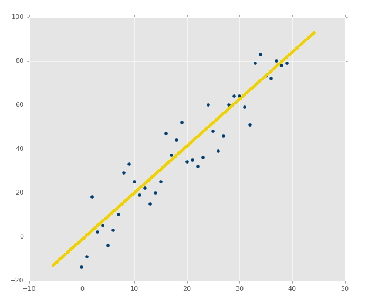
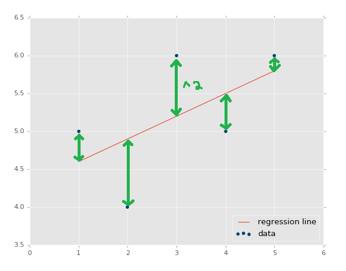
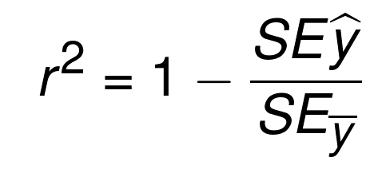

# 第十章 回归 - R 平方和判定系数原理

> 原文：[Regression - R Squared and Coefficient of Determination Theory](https://pythonprogramming.net/r-squared-coefficient-of-determination-machine-learning-tutorial/)

> 译者：[飞龙](https://github.com/wizardforcel)

> 协议：[CC BY-NC-SA 4.0](http://creativecommons.org/licenses/by-nc-sa/4.0/)

欢迎阅读第十篇教程。我们刚刚完成了线性模型的创建和处理，现在我们好奇接下来要干什么。现在，我们可以轻易观察数，并决定线性回归模型有多么准确。但是，如果你的线性回归模型是拿神经网络的 20 个层级做出来的呢？不仅仅是这样，你的模型以步骤或者窗口工作，也就是一共 5 百万个数据点，一次只显示 100 个，会怎么样？你需要一些自动化的方式来判断你的最佳拟合直线有多好。

回忆之前，我们展示几个绘图的时候，你已经看到，最佳拟合直线好还是不好。像这样：



与这个相比：


第二张图片中，的确有最佳拟合直线，但是没有人在意。即使是最佳拟合直线也是没有用的。并且，我们想在花费大量计算能力之前就知道它。

检查误差的标准方式就是使用平方误差。你可能之前听说过，这个方法叫做 R 平方或者判定系数。什么叫平方误差呢？



回归直线和数据的`y`值的距离，就叫做误差，我们将其平方。直线的平方误差是它们的平均或者和。我们简单求和吧。

我们实际上已经解除了平方误差假设。我们的最佳拟合直线方程，用于计算最佳拟合回归直线，就是证明结果。其中回归直线就是拥有最小平方误差的直线（所以它才叫做最小二乘法）。你可以搜索“回归证明”，或者“最佳拟合直线证明”来理解它。它很抑郁理解，但是需要代数变形能力来得出结果。

为啥是平方误差？为什么不仅仅将其加起来？首先，我们想要一种方式，将误差规范化为距离，所以误差可能是 -5，但是，平方之后，它就是正数了。另一个原因是要进一步惩罚离群点。进一步的意思是，它影响误差的程度更大。这就是人们所使用的标准方式。你也可以使用`4, 6, 8`的幂，或者其他。你也可以仅仅使用误差的绝对值。如果你只有一个挑战，也许就是存在一些离群点，但是你并不打算管它们，你就可以考虑使用绝对值。如果你比较在意离群点，你就可以使用更高阶的指数。我们会使用平方，因为这是大多数人所使用的。

好的，所以我们计算回归直线的平方误差，什么计算呢？这是什么意思？平方误差完全和数据集相关，所以我们不再需要别的东西了。这就是 R 平方引入的时候了，也叫作判定系数。方程是：



```py
y_hat = x * m + b
r_sq = 1 - np.sum((y - y_hat) ** 2) / np.sum((y - y.mean()) ** 2)
```

这个方程的的本质就是，1 减去回归直线的平方误差，比上 y 平均直线的平方误差。 y 平均直线就是数据集中所有 y 值的均值，如果你将其画出来，它是一个水平的直线。所以，我们计算 y 平均直线，和回归直线的平方误差。这里的目标是识别，与欠拟合的直线相比，数据特征的变化产生了多少误差。

所以判定系数就是上面那个方程，如何判定它是好是坏？我们看到了它是 1 减去一些东西。通常，在数学中，你看到他的时候，它返回了一个百分比，它是 0 ~ 1 之间的数值。你认为什么是好的 R 平方或者判定系数呢？让我们假设这里的 R 平方是 0.8，它是好是坏呢？它比 0.3 是好还是坏？对于 0.8 的 R 平方，这就意味着回归直线的平方误差，比上 y 均值的平方误差是 2 比 10。这就是说回归直线的误差非常小于 y 均值的误差。听起来不错。所以 0.8 非常好。

那么与判定系数的值 0.3 相比呢？这里，它意味着回归直线的平方误差，比上 y 均值的平方误差是 7 比 10。其中 7 比 10 要坏于 2 比 10，7 和 2 都是回归直线的平方误差。因此，目标是计算 R 平方值，或者叫做判定系数，使其尽量接近 1。
