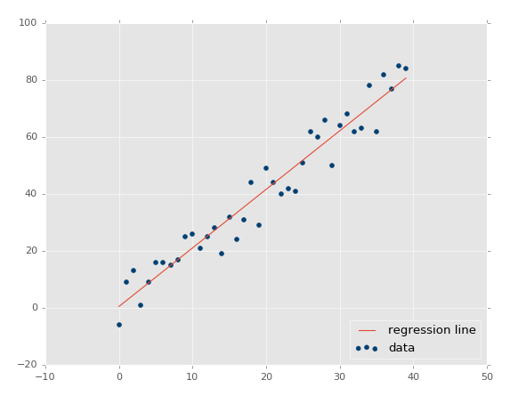
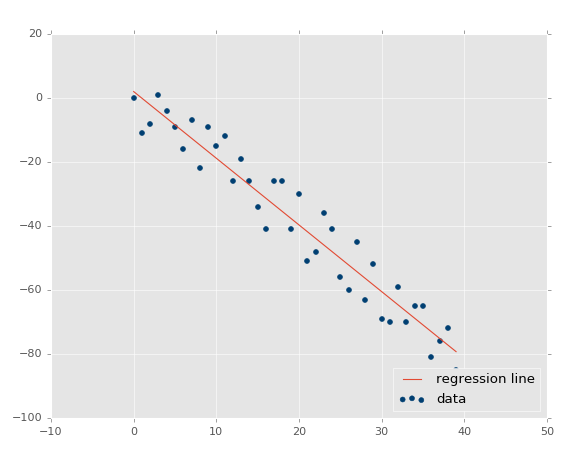
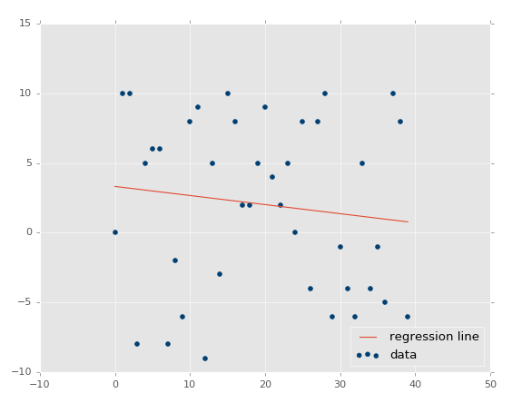

# 第十二章 为测试创建样例数据集

> 原文：[Creating Sample Data for Testing](https://pythonprogramming.net/sample-data-testing-machine-learning-tutorial/)

> 译者：[飞龙](https://github.com/wizardforcel)

> 协议：[CC BY-NC-SA 4.0](http://creativecommons.org/licenses/by-nc-sa/4.0/)

欢迎阅读第十二篇教程。我们已经了解了回归，甚至编写了我们自己的简单线性回归算法。并且，我们也构建了判定系数算法来检查最佳拟合直线的准确度和可靠性。我们之前讨论和展示过，最佳拟合直线可能不是最好的拟合，也解释了为什么我们的示例方向上是正确的，即使并不准确。但是现在，我们使用两个顶级算法，它们由一些小型算法组成。随着我们继续构造这种算法层次，如果它们之中有个小错误，我们就会遇到麻烦，所以我们打算验证我们的假设。

在编程的世界中，系统化的程序测试通常叫做“单元测试”。这就是大型程序构建的方式，每个小型的子系统都不断检查。随着大型程序的升级和更新，可以轻易移除一些和之前系统冲突的工具。使用机器学习，这也是个问题，但是我们的主要关注点仅仅是测试我们的假设。最后，你应该足够聪明，可以为你的整个机器学习系统创建单元测试，但是目前为止，我们需要尽可能简单。

我们的假设是，我们创建了最贱he直线，之后使用判定系数法来测量。我们知道（数学上），R 平方的值越低，最佳拟合直线就越不好，并且越高（接近 1）就越好。我们的假设是，我们构建了一个这样工作的系统，我们的系统有许多部分，即使是一个小的操作错误都会产生很大的麻烦。我们如何测试算法的行为，保证任何东西都预期工作呢？

这里的理念是创建一个样例数据集，由我们定义，如果我们有一个正相关的数据集，相关性非常强，如果相关性很弱的话，点也不是很紧密。我们用眼睛很容易评测这个直线，但是机器应该做得更好。让我们构建一个系统，生成示例数据，我们可以调整这些参数。

最开始，我们构建一个框架函数，模拟我们的最终目标：

```py
def create_dataset(hm,variance,step=2,correlation=False):

    return np.array(xs, dtype=np.float64),np.array(ys,dtype=np.float64)
```

我们查看函数的开头，它接受下列参数：

+   `hm`（how much）：这是生成多少个数据点。例如我们可以选择 10，或者一千万。

+   `variance`：决定每个数据点和之前的数据点相比，有多大变化。变化越大，就越不紧密。

+   `step`：每个点距离均值有多远，默认为 2。

+   `correlation`：可以为`False`、`pos`或者`neg`，决定不相关、正相关和负相关。

要注意，我们也导入了`random`，这会帮助我们生成（伪）随机数据集。

现在我们要开始填充函数了。

```py
def create_dataset(hm,variance,step=2,correlation=False):
    val = 1
    ys = []
    for i in range(hm):
        y = val + random.randrange(-variance,variance)
        ys.append(y)
```

非常简单，我们仅仅使用`hm`变量，迭代我们所选的范围，将当前值加上一个负差值到证差值的随机范围。这会产生数据，但是如果我们想要的话，它没有相关性。让我们这样：

```py
def create_dataset(hm,variance,step=2,correlation=False):
    val = 1
    ys = []
    for i in range(hm):
        y = val + random.randrange(-variance,variance)
        ys.append(y)
        if correlation and correlation == 'pos':
            val+=step
        elif correlation and correlation == 'neg':
            val-=step
```

非常棒了，现在我们定义好了 y 值。下面，让我们创建 x，它更简单，只是返回所有东西。

```py
def create_dataset(hm,variance,step=2,correlation=False):
    val = 1
    ys = []
    for i in range(hm):
        y = val + random.randrange(-variance,variance)
        ys.append(y)
        if correlation and correlation == 'pos':
            val+=step
        elif correlation and correlation == 'neg':
            val-=step

    xs = [i for i in range(len(ys))]
    
    return np.array(xs, dtype=np.float64),np.array(ys,dtype=np.float64)
```

我们准备好了。为了创建样例数据集，我们所需的就是：

```py
xs, ys = create_dataset(40,40,2,correlation='pos')
```

让我们将之前线性回归教程的代码放到一起：

```py
from statistics import mean
import numpy as np
import random
import matplotlib.pyplot as plt
from matplotlib import style
style.use('ggplot')


def create_dataset(hm,variance,step=2,correlation=False):
    val = 1
    ys = []
    for i in range(hm):
        y = val + random.randrange(-variance,variance)
        ys.append(y)
        if correlation and correlation == 'pos':
            val+=step
        elif correlation and correlation == 'neg':
            val-=step

    xs = [i for i in range(len(ys))]
    
    return np.array(xs, dtype=np.float64),np.array(ys,dtype=np.float64)

def best_fit_slope_and_intercept(xs,ys):
    m = (((mean(xs)*mean(ys)) - mean(xs*ys)) /
         ((mean(xs)*mean(xs)) - mean(xs*xs)))
    
    b = mean(ys) - m*mean(xs)

    return m, b


def coefficient_of_determination(ys_orig,ys_line):
    y_mean_line = [mean(ys_orig) for y in ys_orig]

    squared_error_regr = sum((ys_line - ys_orig) * (ys_line - ys_orig))
    squared_error_y_mean = sum((y_mean_line - ys_orig) * (y_mean_line - ys_orig))

    print(squared_error_regr)
    print(squared_error_y_mean)

    r_squared = 1 - (squared_error_regr/squared_error_y_mean)

    return r_squared


xs, ys = create_dataset(40,40,2,correlation='pos')
m, b = best_fit_slope_and_intercept(xs,ys)
regression_line = [(m*x)+b for x in xs]
r_squared = coefficient_of_determination(ys,regression_line)
print(r_squared)

plt.scatter(xs,ys,color='#003F72', label = 'data')
plt.plot(xs, regression_line, label = 'regression line')
plt.legend(loc=4)
plt.show()
```

执行代码，你会看到：


判定系数是 0.516508576011（要注意你的结果不会相同，因为我们使用了随机数范围）。

不错，所以我们的假设是，如果我们生成一个更加紧密相关的数据集，我们的 R 平方或判定系数应该更好。如何实现它呢？很简单，把范围调低。

```py
xs, ys = create_dataset(40,10,2,correlation='pos')
```



现在我们的 R 平方值为 0.939865240568，非常不错，就像预期一样。让我们测试负相关：

```py
xs, ys = create_dataset(40,10,2,correlation='neg')
```



R 平方值是 0.930242442156，跟之前一样好，由于它们参数相同，只是方向不同。

这里，我们的假设证实了：变化越小 R 值和判定系数越高，变化越大 R 值越低。如果是不相关呢？应该很低，接近于 0，除非我们的随机数排列实际上有相关性。让我们测试：

```py
xs, ys = create_dataset(40,10,2,correlation=False)
```



判定系数为 0.0152650900427。

现在为止，我觉得我们应该感到自信，因为事情都符合我们的预期。

既然我们已经对简单的线性回归很熟悉了，下个教程中我们开始讲解分类。
