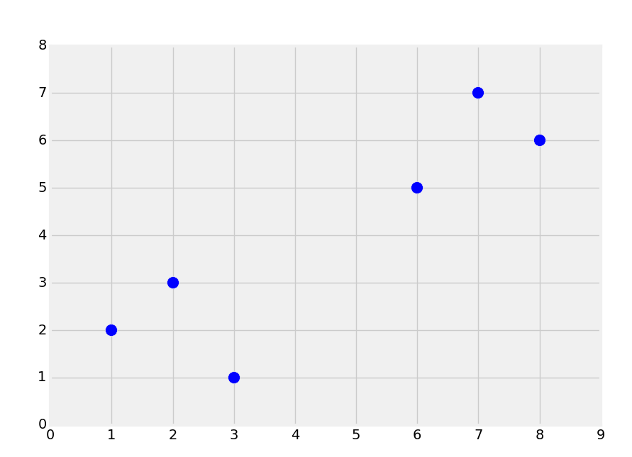
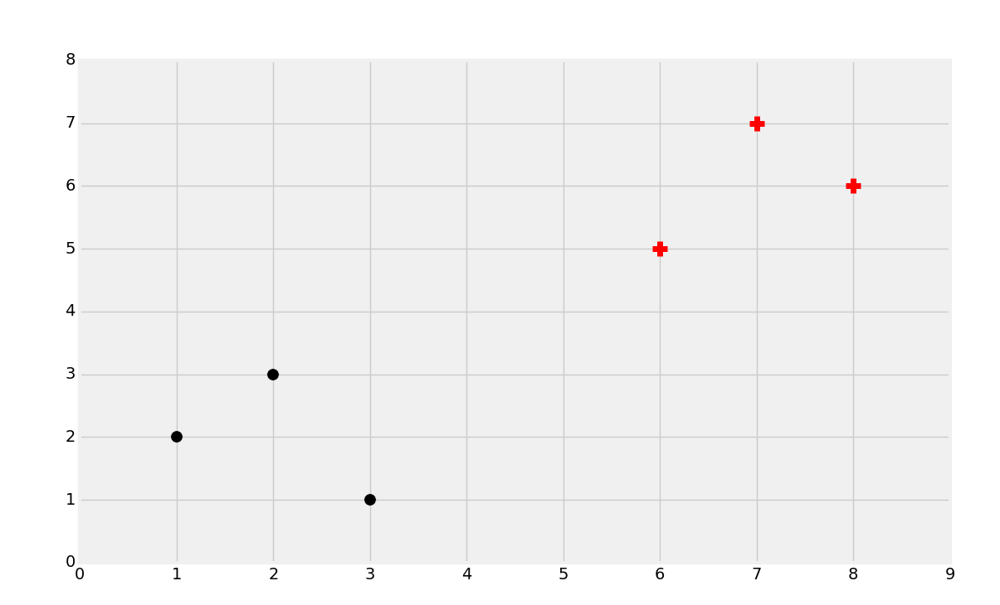
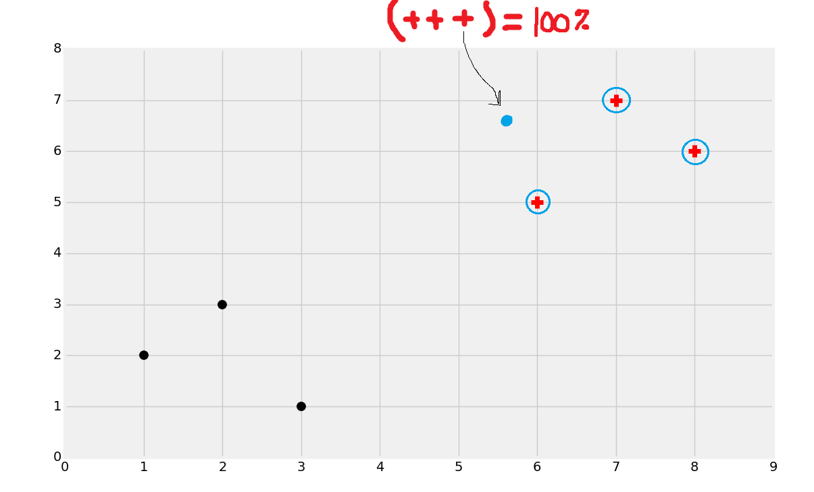

# 第十三章 KNN 分类入门

> 原文：[Classification Intro with K Nearest Neighbors](https://pythonprogramming.net/k-nearest-neighbors-intro-machine-learning-tutorial/)

> 译者：[飞龙](https://github.com/wizardforcel)

> 协议：[CC BY-NC-SA 4.0](http://creativecommons.org/licenses/by-nc-sa/4.0/)

欢迎阅读第十三篇机器学习系列讲义。我们开始了一个全新的部分：分类。这面，我们会涉及两个主要的分类算法：K 最近邻和支持向量机（SVM）。这两个算法都是分类算法，它们的工作方式不同。

首先，让我们考虑一个数据集，创建下面的图像：

直观上，你应该能够看到两个组。但是，分类是监督式机器学习。当我们将数据提供给机器学习算法的时候，我们实际上已经告诉它组的存在，以及哪个数据属于哪个组。一个机器学习的相似形式是聚类，其中你让机器寻找组，但它是非监督机器学习算法，后面我们会降到。所以，使用监督式机器学习，我们需要拥有预置标签的数据用于训练，像这样：

这里我们拥有黑的点和红的点。分类的目标就是拿已知的数据训练机器，就像这样，使机器能够识别新数据的分类（红的还是黑的）。例如，我们会处理乳腺肿瘤的数据，来基于一些属性尝试判断是良性的还是恶性的。我们实现它的方式，就是获取已知的样本属性，例如大小、形状作为特征，标签或者分类就是良性或者恶性。这里，我们可以根据纵六的相同属性来评估未来的肿瘤，并且预测是良性还是恶性。

所以，分类的目标就是识别下面的点属于哪个类：

你可能能猜到它是红的类，但是为什么呢？尝试为自己定义这里有什么参数。下面这种情况呢？

第二种情况中我们可能选取黑色。同样，尝试定义为啥这么选择。最后，如果是这样：

这种情况比较复杂，尝试选取一种分类。

大多数人都会选择黑色。无论哪种，考虑为什么你会做出这种选择。多数人会根据近似性对数据集分组。直觉上它是最有意义的。如果你拿尺子画出它到最近的黑色点的直线，之后画出它到最近的红色点的直线，你就会发现黑色点更近一些。与之相似，当数据点距离一个分组比另一个更近时，你就会基于近似性做出判断。因此 KNN 机器学习算法就诞生了。

KNN 是个简单高效的机器学习分类算法。如果这非常简单，就像我们看到的那样，我们为什么需要一个算法，而不是直接拿眼睛看呢？就像回归那样，机器可以计算得更快，处理更大的数据集，扩展，以及更重要的是，处理更多维度，例如 100 维。

它的工作方式就是它的名字。K 就是你选取的数量，近邻就是已知数据中的相邻数据点。我们寻找任意数量的“最近”的相邻点。假设`K=3`，所以我们就寻找三个最近的相邻点。例如：

上面的图中，我圈出了三个最近的相邻点。这里，所有三个点都是红色分类。KNN 会基于相邻点进行计数。所有三个近邻都是红色，所以它 100% 是红色分类。如果两个近邻都是红色，一个是黑色，我们也将其分类为红色，只是置信度就少了。要注意，由于计数的本质，你会更希望使用奇数 K，否则会产生 50:50 的情况。有一种方式在距离上应用权重，来惩罚那些更远的点，所以你就可以使用偶数的 K 值了。

下一个教程中，我们会涉及到 Scikit 的 KNN 算法，来处理乳腺肿瘤数据，之后我们会尝试自己来编写这个算法。
