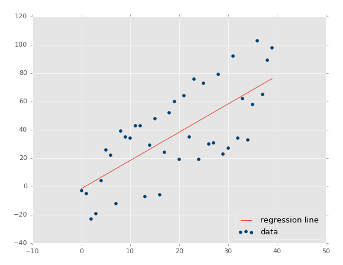

# 第二章 回归 - 引言和数据

> 原文：[Regression - Intro and Data](https://pythonprogramming.net/regression-introduction-machine-learning-tutorial/)

> 译者：[飞龙](https://github.com/wizardforcel)

> 协议：[CC BY-NC-SA 4.0](http://creativecommons.org/licenses/by-nc-sa/4.0/)

欢迎阅读 Python 机器学习系列教程的回归部分。这里，你应该已经安装了 Scikit-Learn。如果没有，安装它，以及 Pandas 和 Matplotlib。

```
pip install numpy

pip install scipy

pip install scikit-learn

pip install matplotlib

pip install pandas
```

除了这些教程范围的导入之外，我们还要在这里使用 Quandl：

```
pip install quandl
```

首先，对于我们将其用于机器学习而言，什么是回归呢？它的目标是接受连续数据，寻找最适合数据的方程，并能够对特定值进行预测。使用简单的线性回归，你可以仅仅通过创建最佳拟合直线，来实现它。



这里，我们可以使用这条直线的方程，来预测未来的价格，其中日期是 x 轴。

回归的热门用法是预测股票价格。由于我们会考虑价格随时间的流动，并且使用连续的数据集，尝试预测未来的下一个流动价格，所以可以这样做。

回归是监督的机器学习的一种，也就是说，科学家向其展示特征，之后向其展示正确答案来教会机器。一旦教会了机器，科学家就能够使用一些不可见的数据来测试机器，其中科学家知道正确答案，但是机器不知道。机器的答案会与已知答案对比，并且度量机器的准确率。如果准确率足够高，科学家就会考虑将其算法用于真实世界。

由于回归广泛用于股票价格，我们可以使用一个示例从这里开始。最开始，我们需要数据。有时候数据易于获取，有时你需要出去并亲自收集。我们这里，我们至少能够以简单的股票价格和成交量信息开始，它们来自 Quandl。我们会抓取 Google 的股票价格，它的代码是`GOOGL`：

```py
import pandas as pd
import quandl

df = quandl.get("WIKI/GOOGL")

print(df.head())
```

注意：写这篇文章的时候，Quandl 的模块使用大写 Q 引用，但现在是小写 q，所以`import quandl`。

到这里，我们拥有：

```
              Open    High     Low   Close    Volume  Ex-Dividend  \
Date                                                                
2004-08-19  100.00  104.06   95.96  100.34  44659000            0   
2004-08-20  101.01  109.08  100.50  108.31  22834300            0   
2004-08-23  110.75  113.48  109.05  109.40  18256100            0   
2004-08-24  111.24  111.60  103.57  104.87  15247300            0   
2004-08-25  104.96  108.00  103.88  106.00   9188600            0   

            Split Ratio  Adj. Open  Adj. High  Adj. Low  Adj. Close  \
Date                                                                  
2004-08-19            1     50.000      52.03    47.980      50.170   
2004-08-20            1     50.505      54.54    50.250      54.155   
2004-08-23            1     55.375      56.74    54.525      54.700   
2004-08-24            1     55.620      55.80    51.785      52.435   
2004-08-25            1     52.480      54.00    51.940      53.000   

            Adj. Volume  
Date                     
2004-08-19     44659000  
2004-08-20     22834300  
2004-08-23     18256100  
2004-08-24     15247300  
2004-08-25      9188600 
```

这是个非常好的开始，我们拥有了数据，但是有点多了。

这里，我们有很多列，许多都是多余的，还有些不怎么变化。我们可以看到，常规和修正（Adj）的列是重复的。修正的列看起来更加理想。常规的列是当天的价格，但是股票有个叫做分拆的东西，其中一股突然就变成了两股，所以一股的价格要减半，但是公司的价值不变。修正的列为股票分拆而调整，这使得它们对于分析更加可靠。

所以，让我们继续，削减原始的 DataFrame。

```py
df = df[['Adj. Open',  'Adj. High',  'Adj. Low',  'Adj. Close', 'Adj. Volume']]
```

现在我们拥有了修正的列，以及成交量。有一些东西需要注意。许多人谈论或者听说机器学习，就像无中生有的黑魔法。机器学习可以突出已有的数据，但是数据需要先存在。你需要有意义的数据。所以你怎么知道是否有意义呢？我的最佳建议就是，仅仅简化你的大脑。考虑一下，历史价格会决定未来价格吗？有些人这么认为，但是久而久之这被证实是错误的。但是历史规律呢？突出的时候会有意义（机器学习会有所帮助），但是还是太弱了。那么，价格变化和成交量随时间的关系，再加上历史规律呢？可能更好一点。所以，你已经能够看到，并不是数据越多越好，而是我们需要使用有用处的数据。同时，原始数据应该做一些转换。

考虑每日波动，例如最高价减最低价的百分比差值如何？每日的百分比变化又如何呢？你觉得`Open, High, Low, Close`这种简单数据，还是`Close, Spread/Volatility, %change daily`更好？我觉得后者更好一点。前者都是非常相似的数据点，后者基于前者的统一数据创建，但是带有更加有价值的信息。

所以，并不是你拥有的所有数据都是有用的，并且有时你需要对你的数据执行进一步的操作，并使其更加有价值，之后才能提供给机器学习算法。让我们继续并转换我们的数据：

```py
df['HL_PCT'] = (df['Adj. High'] - df['Adj. Low']) / df['Adj. Close'] * 100.0
```

这会创建一个新的列，它是基于收盘价的百分比极差，这是我们对于波动的粗糙度量。下面，我们会计算每日百分比变化：

```py
df['PCT_change'] = (df['Adj. Close'] - df['Adj. Open']) / df['Adj. Open'] * 100.0
```
现在我们会定义一个新的 DataFrame：

```py
df = df[['Adj. Close', 'HL_PCT', 'PCT_change', 'Adj. Volume']]
print(df.head())
```

```
            Adj. Close    HL_PCT  PCT_change  Adj. Volume
Date                                                     
2004-08-19      50.170  8.072553    0.340000     44659000
2004-08-20      54.155  7.921706    7.227007     22834300
2004-08-23      54.700  4.049360   -1.218962     18256100
2004-08-24      52.435  7.657099   -5.726357     15247300
2004-08-25      53.000  3.886792    0.990854      9188600
```
