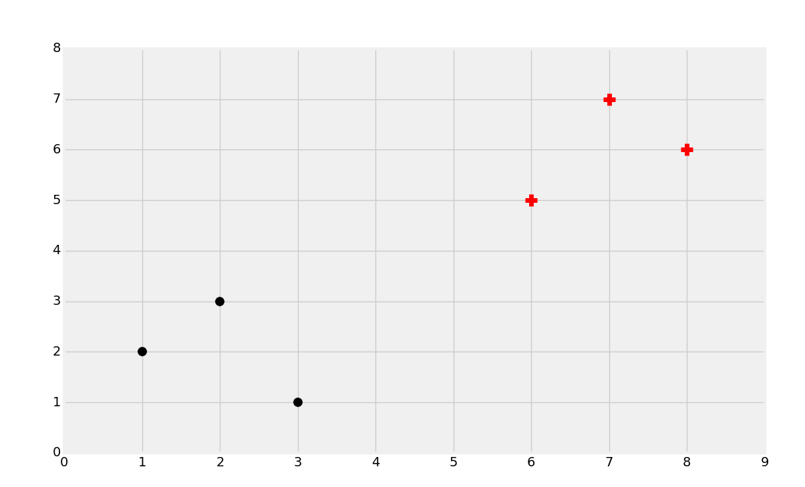
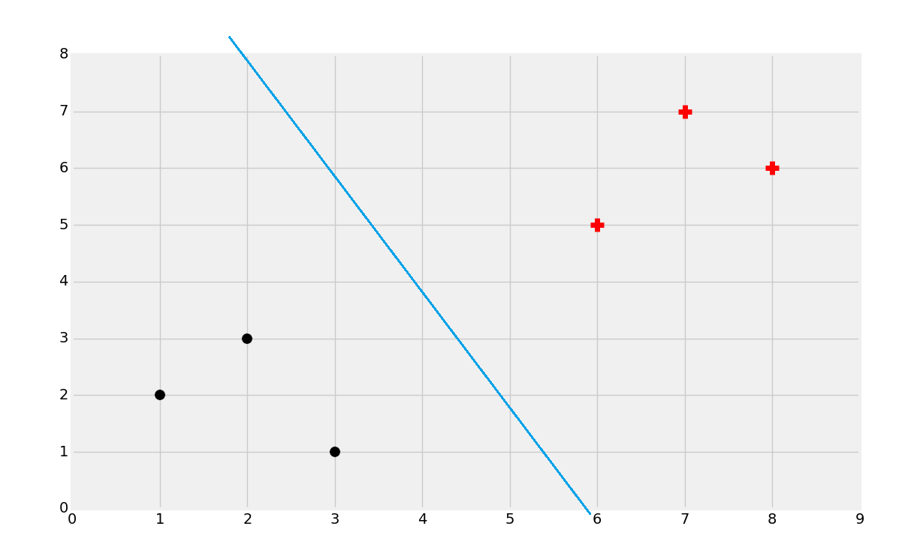
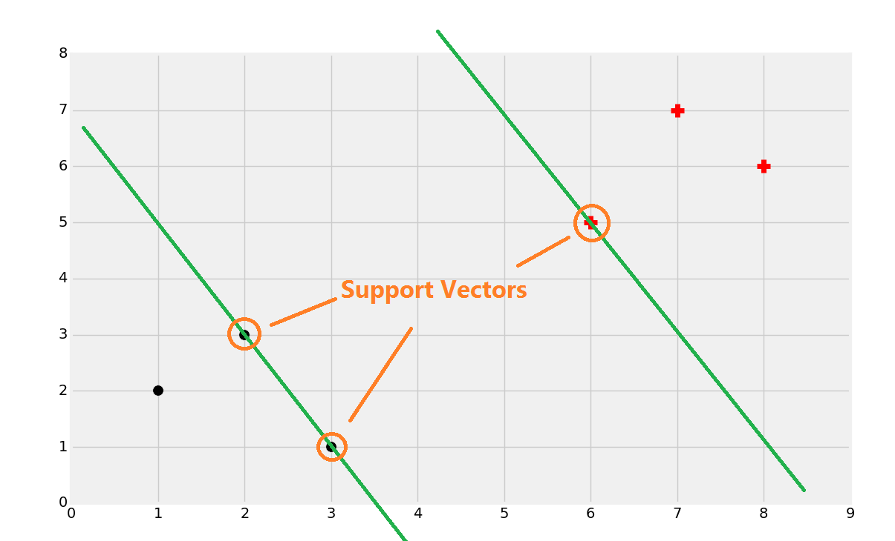
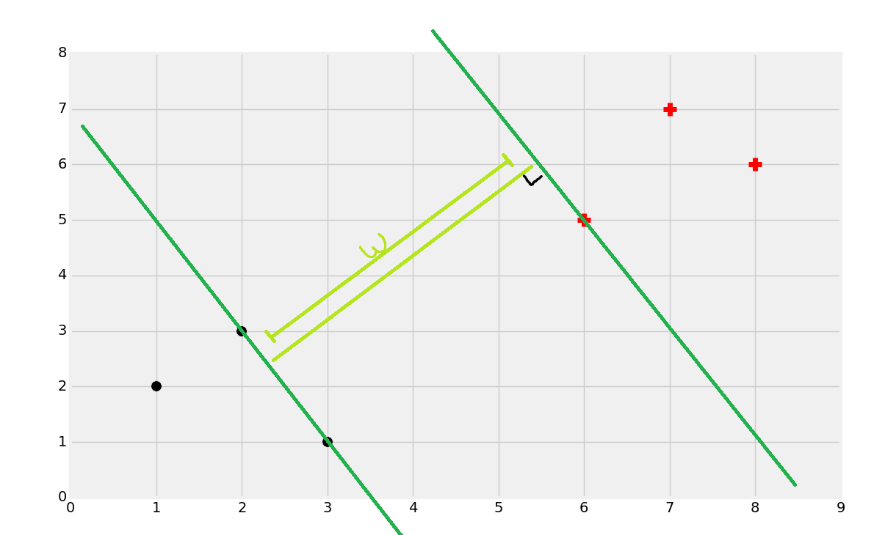
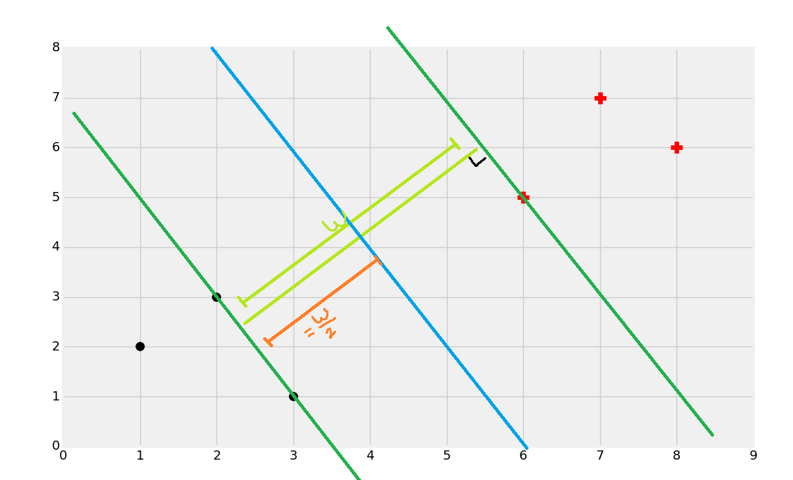
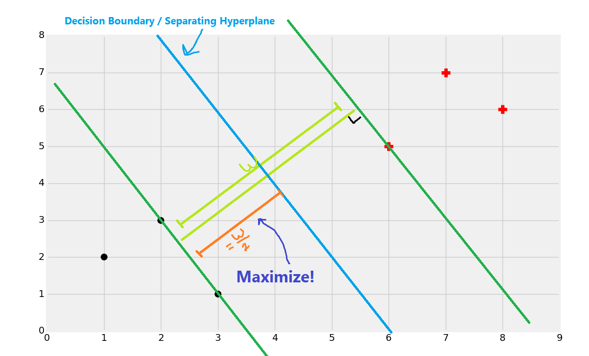

# 第二十章 支持向量机简介

> 原文：[Support Vector Machine introduction](https://pythonprogramming.net/support-vector-machine-intro-machine-learning-tutorial/)

> 译者：[飞龙](https://github.com/wizardforcel)

> 协议：[CC BY-NC-SA 4.0](http://creativecommons.org/licenses/by-nc-sa/4.0/)

欢迎阅读第二十篇。我们现在打算深入另一个监督式机器学习和分类的形式：支持向量机。

支持向量机，由 Vladimir Vapnik 在上个世纪 60 年代发明，但是 90 年代之前都被忽视，并且是最热门的机器学习分类器之一。

支持向量的目标就是寻找数据之间的最佳分割边界。在二维空间中，你可以将其看做分隔你的数据集的最佳拟合直线。使用支持向量机，我们在向量空间中处理问题，因此分隔直线实际上是个单独的超平面。最佳的分隔超平面定义为，支持向量之间间距“最宽”的超平面。超平面也可以叫做决策边界。最简单的讲解方式就是图片：



我们会使用上面的数据开始。我们注意到，之前最普遍的直觉就是，你会将一个新的点基于它的近邻来分类，这就是 KNN 的工作原理。这个方式的主要问题是，对于每个数据点，你将其与每个其它数据点比较，来获取距离，因为算法不能很好扩展，尽管准确率上很可靠。支持向量机的目标就是，一次性生成“最佳拟合”直线（实际上是个平面，甚至是个超平面），他可以最优划分数据。一旦计算出了超平面，我们就将其作为决策边界。我们这样做，因为决策边界划分两个分类的数据。一旦我们计算了决策边界，我们就再也不需要计算了，除非我们重新训练数据集。因此，算法易于扩展，不像 KNN 分类器。

好奇之处在于，我们如何找出最佳分隔超平面？我们可以先使用眼睛来找。



这几乎是争取的，但是如何寻找呢？首先寻找支持向量。



一旦你找到了支持向量，你就可以创建直线，最大分隔彼此。这里，我们可以通过计算总宽度来轻易找到决策边界。



一分为二。



你就会得到边界。



现在如果一个点位于决策边界或者分割超平面的左侧，我们就认为它是黑色分类，否则就是红色分类。

值得注意的是，这个方式本质上只能处理线性分隔的数据，如果你的数据是：


这里你能够创建分隔超平面嘛？不能。还有没有办法了？当我们深入支持向量机的时候，我会让你考虑这个问题。这里是使用 Sklearn 非常方便的原因。记得我们之前使用 Sklearn KNN 分类器的代码嘛？这里就是了。

```py
import numpy as np
from sklearn import preprocessing, cross_validation, neighbors
import pandas as pd

df = pd.read_csv('breast-cancer-wisconsin.data.txt')
df.replace('?',-99999, inplace=True)
df.drop(['id'], 1, inplace=True)

X = np.array(df.drop(['class'], 1))
y = np.array(df['class'])

X_train, X_test, y_train, y_test = cross_validation.train_test_split(X, y, test_size=0.2)

clf = neighbors.KNeighborsClassifier()


clf.fit(X_train, y_train)
confidence = clf.score(X_test, y_test)
print(confidence)

example_measures = np.array([[4,2,1,1,1,2,3,2,1]])
example_measures = example_measures.reshape(len(example_measures), -1)
prediction = clf.predict(example_measures)
print(prediction)
```

我们只需要改动两个地方，第一个就是从`sklearn`导入`svm`。第二个就是使用支持向量分类为，它是`svm.SVC`。改动之后是：

```py
import numpy as np
from sklearn import preprocessing, cross_validation, neighbors, svm
import pandas as pd

df = pd.read_csv('breast-cancer-wisconsin.data.txt')
df.replace('?',-99999, inplace=True)
df.drop(['id'], 1, inplace=True)

X = np.array(df.drop(['class'], 1))
y = np.array(df['class'])

X_train, X_test, y_train, y_test = cross_validation.train_test_split(X, y, test_size=0.2)

clf = svm.SVC()

clf.fit(X_train, y_train)
confidence = clf.score(X_test, y_test)
print(confidence)

example_measures = np.array([[4,2,1,1,1,2,3,2,1]])
example_measures = example_measures.reshape(len(example_measures), -1)
prediction = clf.predict(example_measures)
print(prediction)
# 0.978571428571
# [2]
```

取决于你爹随机样例，你应该得到 94% 到 99% ，平均值为 97%。同样，对操作计时，要记得我通过 Sklearn 执行 KNN 代码花费了 0.044 秒。使用`svm.SVC`，执行时间仅仅是 0.00951，在这个非常小的数据集上也有 4.6 倍。

所以我们可以认为，支持向量机似乎有同样的准确度，但是速度更快。要注意如果我们注释掉丢弃 ID 列的代码，准确率会降到 60%。支持向量机通常比 KNN 算法处理大量数据要好，并且处理离群点要好。但是，这个例子中，无意义数据仍然会误导它。我们之前使用默认参数，查看[支持向量机的文档](https://scikit-learn.org/stable/modules/generated/sklearn.svm.SVC.html)，确实有一些参数，我们不知道它们干什么用。在后面的教程中，我们打算深入支持向量机算法，以便我们能够实际理解所有这些参数的含义，以及它们有什么影响。虽然我们在这里告一段落，思考一下：如何处理非线性分隔，多个分类的数据和数据集（由于 SVM 是个二元分类器，也就是它生成直线来划分两个分组）。
