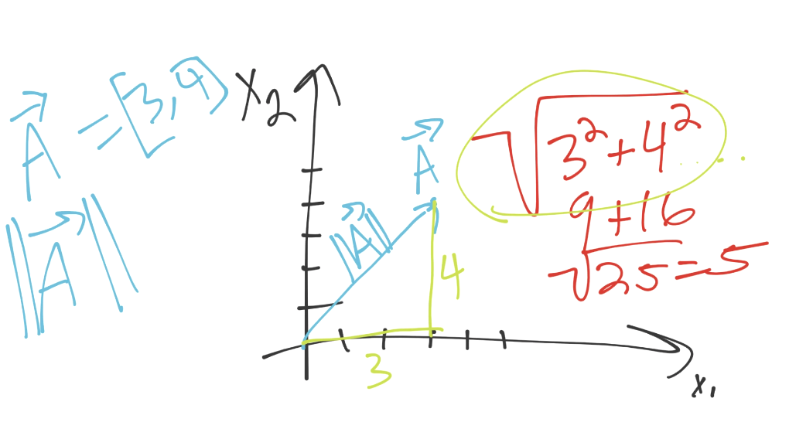

# 第二十一章 向量基础

> 原文：[Vector Basics](https://pythonprogramming.net/vector-basics-machine-learning-tutorial/)

> 译者：[飞龙](https://github.com/wizardforcel)

> 协议：[CC BY-NC-SA 4.0](http://creativecommons.org/licenses/by-nc-sa/4.0/)

欢迎阅读第二十一篇教程，下面就是支持向量机的部分了。这个教程中，我们打算设计一些向量的基础，它们是支持向量机概念的组成部分。

首先，向量拥有模（大小）和方向：

上面的例子中，向量 A（使用字母上面的箭头来表示），向`[3, 4]`移动。可以将每个坐标看做该维度上的方向。我们这里，有两个维度。我们在第一维里面移动 3 个单位，第二维里面移动 4 个。这就是方向了，那么模是什么呢？我们之前看到过它，它就是欧氏距离，范式，或者是大小。对我们来说，最重要的是，它们的计算方式相同（平方和的平方根）。

我们这里，向量的模是 5。如果你仔细观察图片，你可能会注意一些其它东西：

看起来像是直角三角形的勾股（帕斯卡）定理。的确是相同的公式，只要我们进入更高的维度，它就不是简单的三角形了。

很简单，下面是点积。如果我们对向量计算点积会发生什么呢？假设有两个向量，A 和 B。A 是`[1, 3]`，B 是`[4, 2]`。我们所做的是，将对应分量相乘再相加。例如：

好的，既然我们知道了这些东西，我们就要讲解支持向量机本身了。我们作为科学家，首先会在机器上做一些断言。
