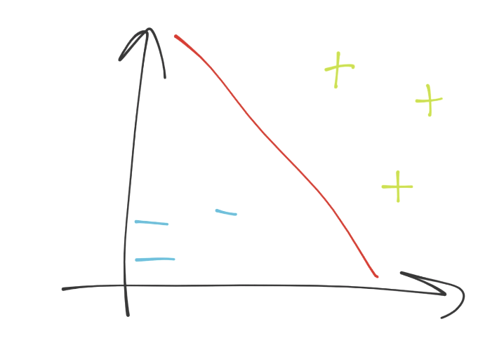
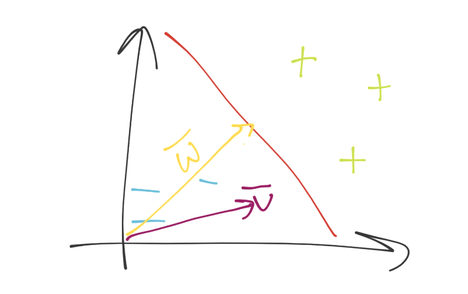
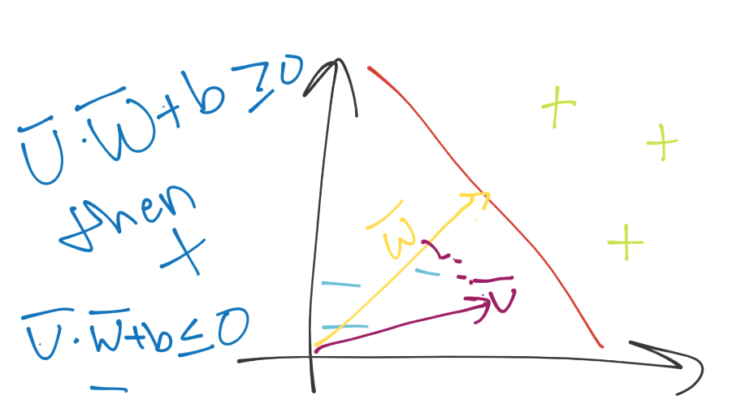
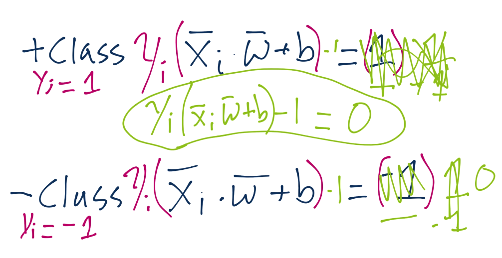

# 第二十二章 支持向量断言

> 原文：[Support Vector Assertions](https://pythonprogramming.net/support-vector-assertions-machine-learning-tutorial/?completed=/vector-basics-machine-learning-tutorial/)

> 译者：[飞龙](https://github.com/wizardforcel)

> 协议：[CC BY-NC-SA 4.0](http://creativecommons.org/licenses/by-nc-sa/4.0/)

欢迎阅读机器学习教程的第二十二章。这个教程中，我们会涉及一些 SVM 的断言。理解这些断言，它们中一些是约束，是是理解 SVM 的数学与美的一部分。

首先，让我们看一看 SVM 的示例目标。它的理念是接受已知数据，之后 SVM 的拟合或者训练是个最优化问题，寻找数据的最佳分隔直线，也就是决策边界，像这样：

我们在二维空间中，所以分隔超平面（决策边界）也就是简单的直线（红色直线）。决策边界分隔了蓝色减号分组，和绿色加号分组。下面，如果我们在图中任意位置放一个点，我们就可以做一个简单的检查，来看看它位于分隔直线的哪一边，我们就会有答案了。是不是很简单？如果我们仅仅停留在二维空间，我们这里的维度是什么呢？每个特征都是一个维度，所有特征组成了我们的特征集。因此，我们可能拥有一条简单的直线，超级简单。我们可以使用线性代数来解决它。但如果我们拥有 63 个特征，也就是 63 维呢？

目前为止还不清楚，但是勾股定理多于二维是没问题的。好的，我们来看看向量空间吧。我们现在在向量空间中了，我们拥有了未知的特征集，记为`v`。之后，我们有了另一个向量（法向量），和决策边界正交，记为`w`。看起来是：

现在如何呢？我们可以用眼睛看出来，但是如何用数学表达呢？同样，要记得你需要一个方法，在 2 维和 5902 维都工作。你可以仅仅将向量`v`和`w`点乘，并加上一些偏移`b`（就是超平面的一般式方程），之后观察这个值大于还是小于 0。

好的，尽管我们这里不知道`w`和`b`都是什么。

然后就复杂了。

我们有了两个未知变量，并且有个坏消息：我们要求解它们。根据优化来说，这应该是个危险信号，也就是有无限个`w`和`b`满足我们的方程，但是我们也知道有一种约束，已经在我们的脑子里定义了逻辑：我们想要最佳的分隔超平面。我们可以大致猜测这是`w`和`b`优化的一部分。最开始我们打算设置一些真实的数学约束。

目前为止，我们仅仅看到了分隔超平面，但是分隔超平面在两个超平面之间。所谓的支持向量经过两个超平面，这些支持向量是特征集（图上的数据点），如果移动了它们，就会对最佳分隔超平面有影响。

由于这些支持向量会产生重大影响，我们打算为其设置一个常量值。前面说，分类函数是`sign(x·w + b)`，如果它是 0，那就说明在决策边界上。如果大于零，就是正向分类，如果小于零，就是负向分类。我们打算利用它，并且认为，如果`x·w + b`为 1，就是正向支持向量，如果为 -1，就是负向支持向量。如果一个未知值是 -0.52，仍然是负向分类，即使它没有超过支持向量的标记 -1。我们简单使用支持向量来帮助我们选取最佳分隔超平面，这就是它们的作用。我们的断言是：

也就是说，第一行，我们让`X`负向支持向量（这是任何为负向支持向量的特征）点乘向量`w`再加`b`等于 -1。我们断言了这个。之后对正向支持向量：`X`正向支持向量点乘向量`w`再加`b`为正一。同样，我们刚开始，没有真正的证明，我们刚刚说这是一个案例。现在，我们打算引入新的值，`Yi`。

y 在 Python 代码中是我们的分类，这里也是。

我们打算向之前的断言引入它，如果你记得正向和负向支持向量的值：`x·w+b=1`是正向，`x·w+b=-1`是负向。我们打算将我们的原始断言相乘：

根据这个新的`Yi`值，它同样是 -1 或者 1（取决于分类是 -1 还是 1）。当我们将原始断言相乘时，我们就需要将两边都乘`Yi`，也就是：

我们将`Yi`的符号留在左边，但是我们实际上将其应用到了右边（1 或者 -1）。这样意味着对于正向支持向量，我们得到了`1x1=1`，对于负向支持向量，我们得到了`(-1)x(-1)=1`，也等于 1。我们可以将每个方程的右边设为 0，通过两边都减一，我们就有了相同的方程`Yi(Xi·w+b)-1 = 0`。

现在我们拥有了约束，下个教程中我们会深入讲解。
