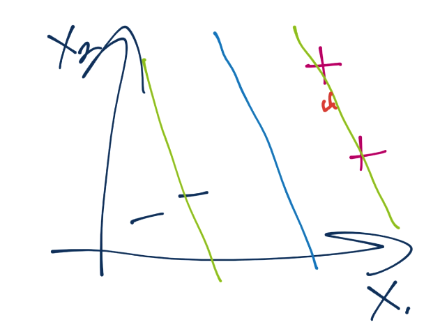
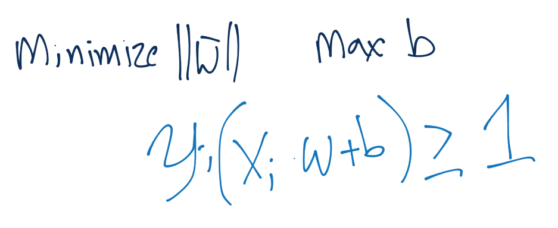
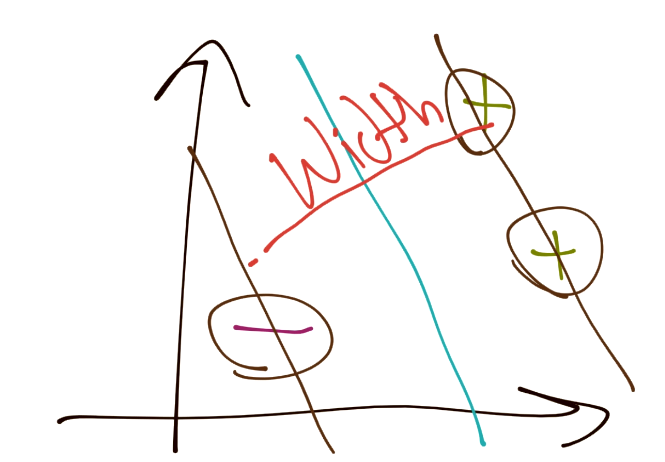
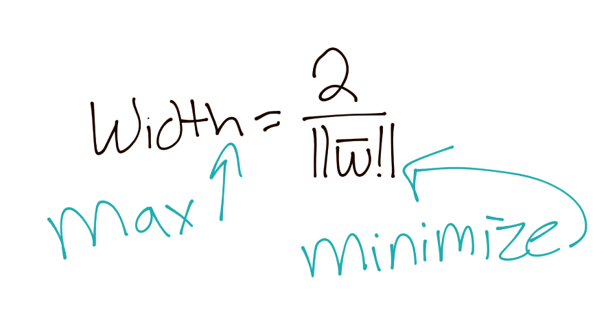
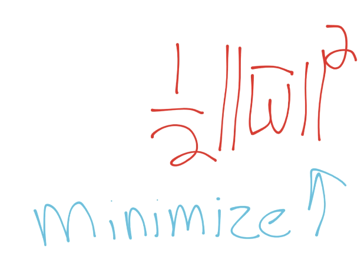

# 第二十三章 支持向量机基础

> 原文：[Support Vector Machine Fundamentals](https://pythonprogramming.net/support-vector-machine-fundamentals-machine-learning-tutorial/)

> 译者：[飞龙](https://github.com/wizardforcel)

> 协议：[CC BY-NC-SA 4.0](http://creativecommons.org/licenses/by-nc-sa/4.0/)

欢迎阅读第二十三篇教程。这篇教程中，我们打算为支持向量机的优化来解方程。

我们需要计算的支持向量为：`Yi(Xi·w+b)-1 = 0`。

现在我们打算讨论一下，我们如何处理这个支持向量机的形式优化问题。特别是，我们如何获取向量`w`和`b`的最优解。我们也会涉及一些支持向量机的其它基础。

开始，之前说过超平面的定义为`w·x+b`。因此，我们断言了该方程中支持向量机的定义，正向类为 1，负向类为 -1。

我们也推测，一旦我们找到了满足约束问题（`w`的模最小，`b`最大）的`w`和`b`，我们用于未知点的分类决策函数，只需要简单计算`x·w+b`。如果值为 0.99 呢？它在图中是什么样子？

所以它并不在正向支持向量平面上，但是很接近了。它超过了决策边界没有？是的，决策边界是`x·w+b=0`。因此，未知数据集的实际决策函数只是`sign(x·w+b)`。就是它了。如果它是正的，就是`+`分类，负的就是`-`分类。现在为了求得这个函数，我们需要`w`和`b`。我们的约束函数，`Yi(Xi·W+b) >= 1`，需要满足每个数据集。我们如何使其大于等于 1 呢？如果不乘 Yi，就仅仅需要我们的已知数据集，如果代入`x·w+b`大于 1 或者小于 -1，尽管我们之前提到过，0.98 的值也是正向分类。原因就是，新的或者未知的数据可以位于支持向量平面和决策边界之间，但是训练集或已知数据不可以。

于是，我们的目标就是最小化`|w|`，最大化`b`，并保持`Yi(X·W+b)>=1`的约束。

要注意，我们尝试满足向量`w`的约束，但是我们需要最小化`w`的模，而不是`w`，不要混淆。

有许多方式来计算这个带约束的最优化。第一个方式就是支持向量机的传统描述。开始，我们尝试将分隔超平面之间的宽度最大化。

下面，向量之间的距离可以记为：

要注意，这里我们得到了`X+`和`X-`，这是两个超平面，我们尝试最大化之间的距离。幸运的是，这里没有`b`，非常好。那么，`X+`和`X-`又是什么呢？我们知道吗？是的，我们知道。

这里就有`b`了。总有一天我们会将其解出来。无论如何，我们做一些代数，将`X+`和`X-`替换为`1-b`和`1+b`。

记得你的操作顺序吗？这非常方便，我们就将`b`移走了，现在我们的方程极大简化了。

为了更好地满足我们未来的要求，我们可以认为，如果我们打算最大化`2/|w|`，我们就可以最小化`|w|`，这个之前已经讲过了。由于我们打算最小化`|w|`，相当于最小化`1/2 * |w|^2`：

我们的约束是` Yi(Xi·W+b)-1 = 0`。因此，所有特征集的和应该也是 0。所以我们引入了拉格朗日乘数法：

在这里求导：

把所有东西放到一起：

于是，如果你没有对求出来的东西不满意，你就到这里了。我们得到了`alpha`的平方，也就是说，我们需要解决一个平方规划。

很快就变复杂了。

下一篇教程中，我们的兴趣是从零编写 SVM，我们看看是否可以将其简化。
