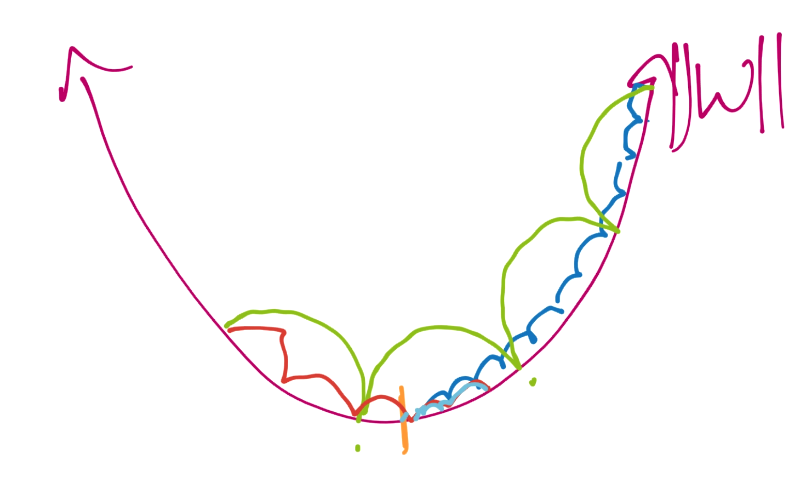
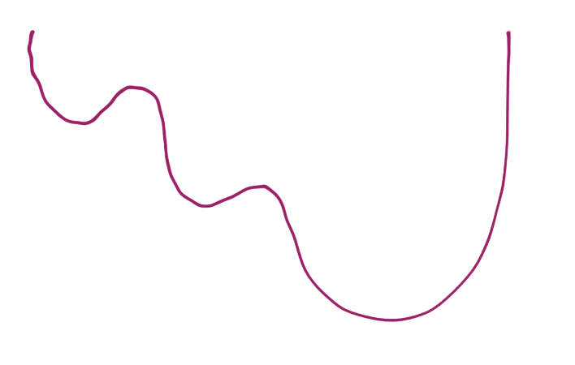

# 第二十四章 约束优化

> 原文：[Constraint Optimization with Support Vector Machine](https://pythonprogramming.net/svm-constraint-optimization-machine-learning-tutorial/)

> 译者：[飞龙](https://github.com/wizardforcel)

> 协议：[CC BY-NC-SA 4.0](http://creativecommons.org/licenses/by-nc-sa/4.0/)

欢迎阅读第二十四篇教程。这个教程中，我们打算深入讨论 SVM 的约束优化。

上一个教程中，我们剩下了 SVM 的形式约束优化问题：

看起来很丑陋，并且由于`alpha`的平方，我们看到了一个平方规划问题，这不是很容易完成。约束优化不是一个很大的范围吗？有没有别的方式？你怎么问我会很高兴，因为是的，的确存在其他方式。SVM 的优化问题是个凸优化问题，其中凸优化的形状是`w`的模。

这个凸优化的目标是寻找`w`的最大模。一种解决凸优化问题的方式就是“下降”，直到你不能再往下走了。一旦你到达了底部，你就能通过其他路径慢慢回去，重复这个步骤，直到你到达了真正的底部。将凸优化问题看做一个碗，求解过程就是沿着碗的边缘扔进去一个球。球会很快滚下边缘，正好达到最中间的位置，之后可能会在另一侧上升，但是会再次下降，沿着另一个路径，可能会重复几次，每次都会移动得更慢，并且距离更短，最终，球会落在碗的底部。

我们会使用 Python 来模拟这个十分相同的问题。我们会专注于向量`w`，以一个很大的模来开始。之前提到过向量的模就是分量的平方和的平方根。也就是说，向量`w`为`[5,5]`或者`[-5,5]`的模都一样。但是和特征集的点积有很大不同，并且是完全不同的超平面。出于这个原因，我们需要检查每个向量的每个变种。

我们的基本思想就是像一个球那样，快速沿侧壁下降，重复知道我们不能再下降了。这个时候，我们需要重复我们的最后几个步骤。我们以更小的步骤来执行。之后可能将这个步骤重复几次，例如：

首先，我们最开始就像绿色的线，我们用大的步长下降。我们会绕过中心，之后用更小的步长，就像红色的线。之后我们会像蓝色的线。这个方式，我们的步长会越来越小（每一步我们都会计算新的向量`w`和`b`）。这样，我们就可以获取最优化的向量`w`，而不需要一开始就使用较大的步长来完成相同结果，并且在处理时浪费很多时间。

如果我们找到了碗或者凸形状的底部，我们就说我们找到了全局最小值。凸优化问题非常好的原因，就是我们可以使用这个迭代方式来找到底部。如果不是凸优化，我们的形状就是这样：

现在，当从左侧开始时，你可能检测到上升了，所以你返回并找到了局部最小值。

再说一遍，我们在处理一个很好的凸优化问题，所以我们不需要担心错误。我的计划就是给定一个向量，缓慢减小向量的模（也就是讲笑向量中数据的绝对值）。对于每个向量，假设是`[10, 10]`，我们会使用这些东西来变换向量：`[1,1],[-1,1],[-1,-1],[1,-1]`。这会向我们提供这个向量的所有变种，我们需要检查它们，尽管它们拥有相同的模。这就是下个教程中要做的事情。
