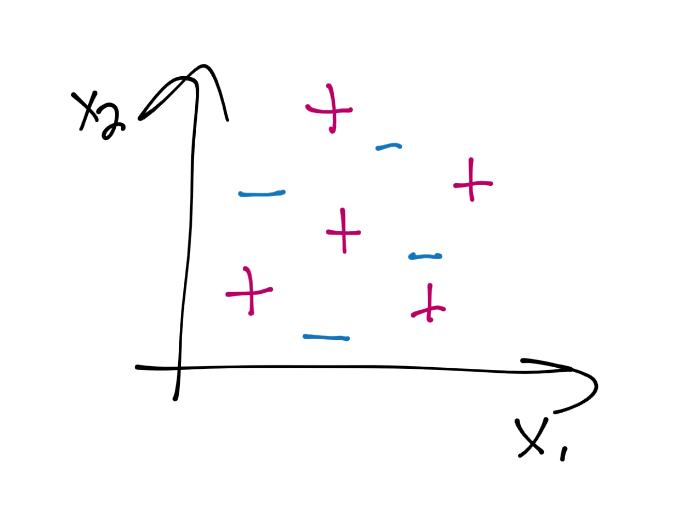
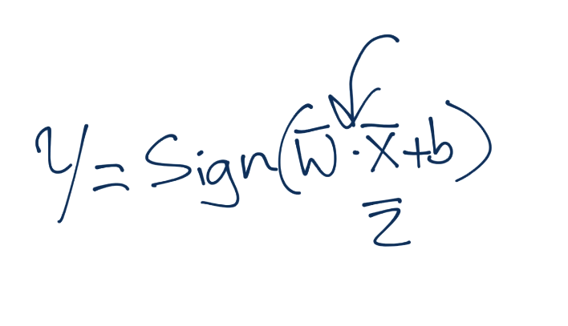
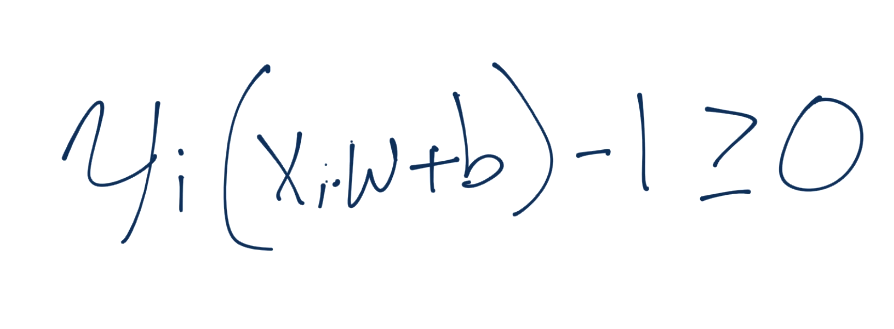
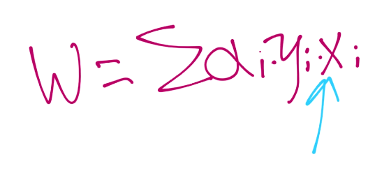
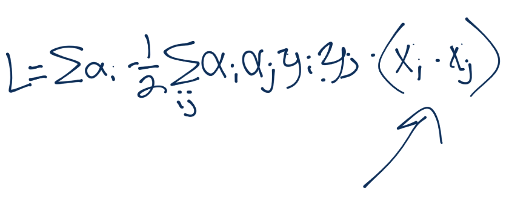

# 第二十九章 核的简介

> 原文：[Kernels Introduction](https://pythonprogramming.net/kernels-with-svm-machine-learning-tutorial/)

> 译者：[飞龙](https://github.com/wizardforcel)

> 协议：[CC BY-NC-SA 4.0](http://creativecommons.org/licenses/by-nc-sa/4.0/)

欢迎阅读第二十九篇教程。这个教程中，我们打算使用机器学习谈论核的概念。

回忆一开始的 SVM 话题，我们的问题是，你可不可以使用 SVM 来处理这样的数据：

至少我们现在为止，它可能吗？不，完全不可能，至少不能是这样。但是一个选择，就是采取新的视角。我们可以通过添加一个新的维度来实现。例如上面的数据中，我们可以添加第三个维度，使用一些函数，比如`X3 = X1*X2`。在这里可能管用，但是也可以不管用。同样，一些案例，比如图像分析又如何呢？其中你可能有多于几百和维度。它就是性能很重要的场景，并且你是否应该添加一个维度到已经有很多维度的数据中，我们会进一步把事情变慢。

如果我告诉你，你可以在无限的维度上做计算，或者，你可以让那些计算在这些维度上实现，而不需要在这些维度上工作，并且仍然能得到结果呢？

就是这样。我们实际上使用叫做核的东西来实现。相对于 SVM 来说，许多人一开始就接触它了，也可能最后才接触。这可能会让你认为，核主要用于 SVM，但是并不是这样。

核就是相似度函数，它接受两个输出，并使用内积来返回相似度。由于这是个机器学习教程，你们中的一些可能想知道，为什么人们不将核用于机器学习算，以及，我在这里告诉你它们实际上使用了。你不仅仅可以使用核来创建自己的机器学习算法，你可以将现有的机器学习算法翻译为使用核的版本。

核所做的就是允许你，处理许多维度，而不需要花费处理的开销。核的确有个要求：它们依赖于内核。对于这篇教程的目的，“点积”和“内积”可以互相代替。

为了验证我们是否可以使用核，我们需要做的，就是验证我们的特征空间的每个交互，都是内积。我们会从末尾开始，然后返回来确认它。

首先，我们如何在训练之后判断特征的分类呢？

它是不是内积的交互呢？当然是，我们可以将`x`换成`z`。

继续，我们打算回顾我们的约束，约束方程为：

这里如何呢？这个交互式内积嘛？当然，` yi(xi.w+b)-1 >= 0`等价于`yi(xi.w+b) >= 1`。所以这里我们可以讲义将`x_i`替换为`z_i`。

最后，我们的形式优化方程`w`如何呢？

它是另一个点积或内积。有任何问题吗？这样：

太好了。我们可以使用核。你可能想知道，这个“零开销来计算无穷维度”是什么？好吧，首先我们需要确保我们能这样做。对于零开销的处理，你需要看下一篇教程来了解。
