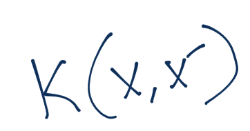
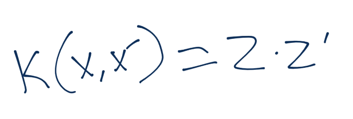
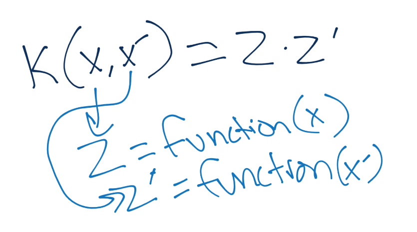
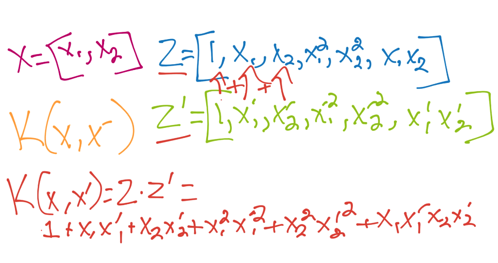
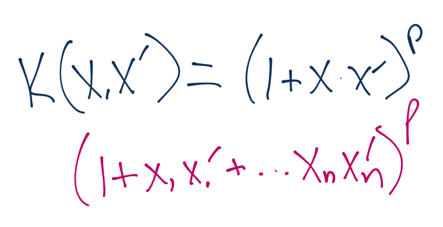
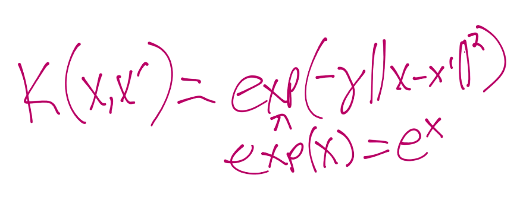

# 第三十章 为什么是核

> 原文：[Why Kernels](https://pythonprogramming.net/why-use-kernel-with-svm-machine-learning-tutorial/)

> 译者：[飞龙](https://github.com/wizardforcel)

> 协议：[CC BY-NC-SA 4.0](http://creativecommons.org/licenses/by-nc-sa/4.0/)

欢迎阅读第三十篇教程。这篇教程中，我们打算继续讨论核，既然我们知道了我们能使用它之后，主要弄清楚如何实际使用它们。

我们之前了解到，我们可以利用核来帮助我们将数据转换为无穷数量的维度，以便找到线性分隔。我们也了解到，核可以让我们处理这些维度，而不需要实际为这些高维度花费开销。通常，核定义为这样：

核函数应用于`x`和`x'`，并等于`z`和`z'`的内积，其中`z`就是`z`维度的值（我们新的维度空间）。

`z`值就是一些`function(x)`的结果，这些`z`值点乘在一起就是我们核函数的结果。

我们仍然需要涉及，它如何节省我们的处理步骤。所以看一个例子吧。我们以多项式来开始，并将多项式核的要求，与简单使用我们的向量来创建二阶多项式来比较：

核对`x`和`x'`使用相同函数，所以我们对`z'`也使用相同的东西（`x'`对二阶多项式）。这里，最终步骤就是计算二者的点积。

所以所有工作就是手动执行一个和核函数类似的操作。幸运的是，我们的起始维度只有两维。现在让我们考虑多项式核：

要注意，这里没有提到`z`。整个核仅仅使用`x`来计算。你所需的所有东西，就是使用维度数量`n`和你想使用的权重`p`来计算。你的方程是这样：

如果你计算了出来，你的新向量是这样，它对应`z`空间的向量：

也就是说，你永远不需要继续深入了。你只需要专注于多项式和，它简单返回点积给你，你不需要实际计算向量，之后计算非常大的点积。

也有一些预先创建的核，但是我这里仅仅会展示径向基函数（RBF）核。只是因为它通常是默认使用的核，并且可以将我们带到无限的维度中。

这里的 Gamma 值是后面教程的话题。所以这里以拥有了核，了解了为什么使用它们，如何使用它们，以及它们如何让你处理更大的维度，而不需要花费非常大的处理开销。下一篇教程中，我们打算讨论另一个非线性数据的解决方案，以及数据的过拟合问题。
