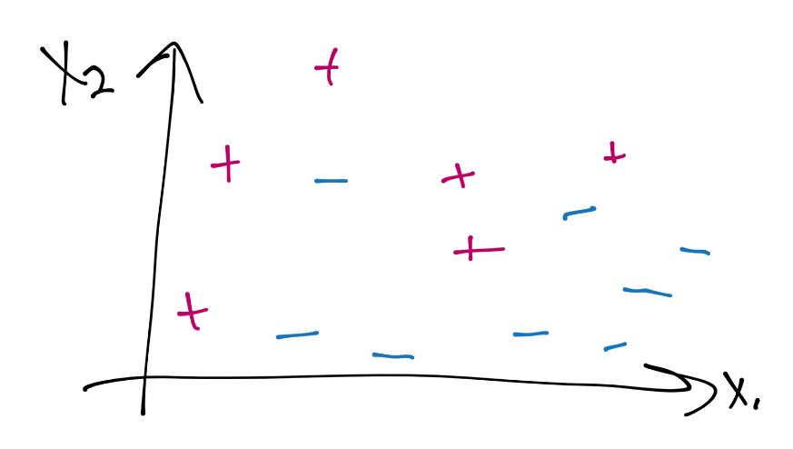
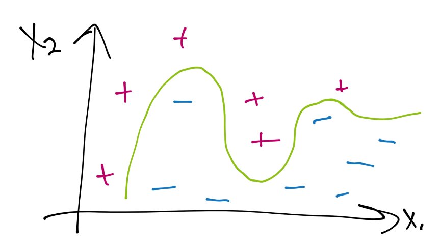
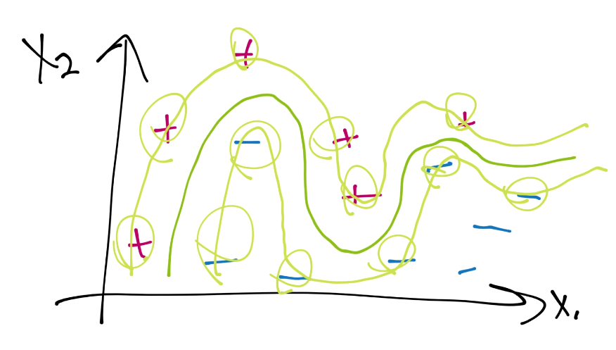
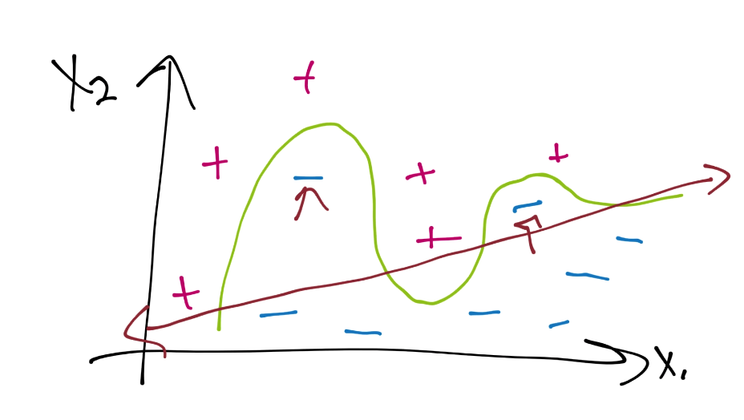
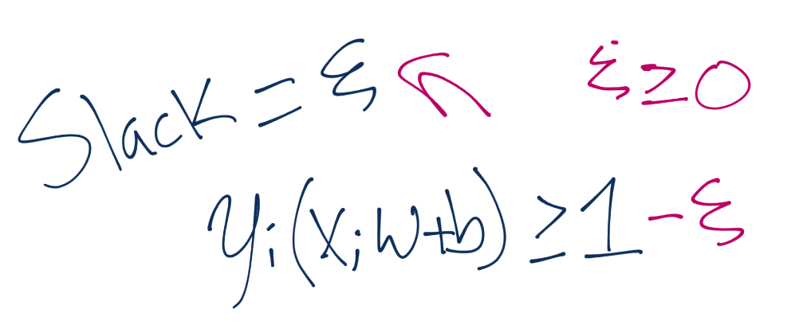

# 第三十一章 软边界 SVM

> 原文：[Soft Margin Support Vector Machine](https://pythonprogramming.net/soft-margin-svm-machine-learning-tutorial/)

> 译者：[飞龙](https://github.com/wizardforcel)

> 协议：[CC BY-NC-SA 4.0](http://creativecommons.org/licenses/by-nc-sa/4.0/)

欢迎阅读第 31 个部分。这篇教程中，我们打算讨论软边界 SVM。

首先，为什么软边界分类器更加优秀，主要有两个原因。一是你的数据可能不是完全线性分隔的，但是很接近了，并且继续使用默认的线性核有更大意义。另一个原因是，即使你使用了某个核，如果你打算使用硬边界的话，你最后也会过拟合。例如，考虑这个：

这里是一个数据案例，当前并不是线性可分的。假设使用硬边界（也就是我们之前看到的那种），我们可能使用核来生成这样的决策边界：

下面，注意我的绘图工具中的缺陷，让我们绘制支持向量平面，并圈出支持向量：

这里，每个正向的数据样例都是支持向量，只有两个负向分类不是支持向量。这个信号就是可能过拟合了，我们应该避免它。因为，当我们用它来预测未来的点时，我们就没有余地了，并且可能会错误分类新的数据。如果我们这样做，会怎么样呢？

我们有一些错误或者误差，由箭头标记，但是这个可能能够更好地为将来的数据集分类。我们这里就拥有了“软边界”分类器，它允许一些误差上的“弹性”，我们可以在优化过程中获得它。

我们的新的优化就是上面的计算，其中弹性大于等于 0。弹性越接近 0，就越接近“硬边界”。弹性越高，边界就越软。如果弹性是 0，我们就得到了一个典型的硬边界分类器。但是你可能能够菜刀，我们希望最小化弹性。为此，我们将其添加到向量`w`的模的最小值中。

因此，我们实际上打算最小化`1/2||w||^2 + C * 所有使用的弹性之和`。使用它，我们引入了另一个变量`C`。`C`是个系数，关于我们打算让弹性对方程的剩余部分有多少影响。`C`阅读，弹性的和与向量`w`的模相比，就越不重要，反之亦然。多数情况下，`C`的值默认为 1。

所以这里你了解了软边界 SVM，以及为什么打算使用它。下面，我们打算展示一些样例代码，它们由软边界、核和 CVXOPT 组成。
