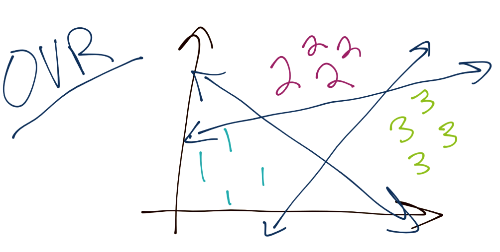
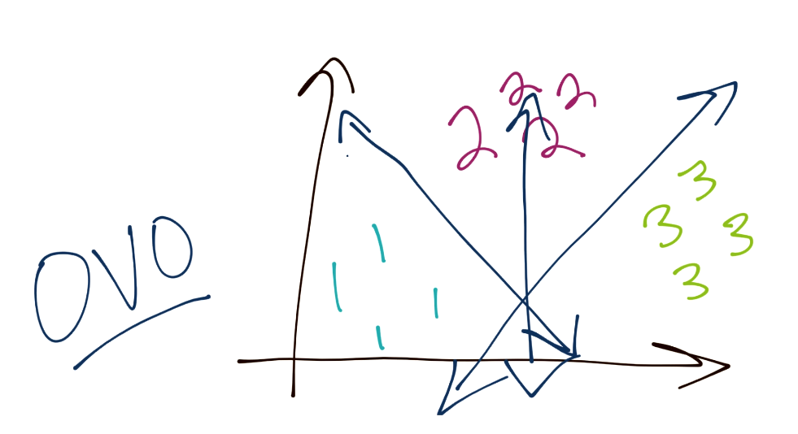
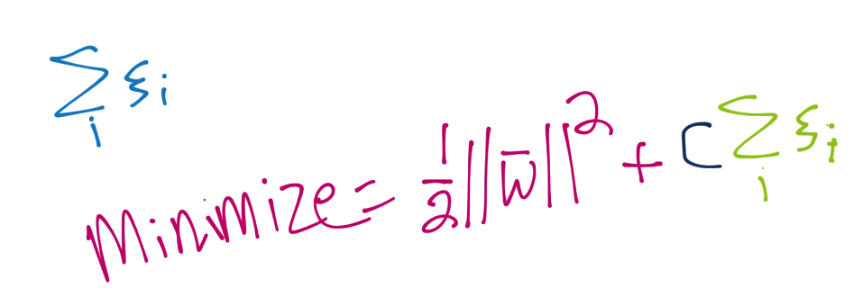

# 第三十三章 支持向量机的参数

> 原文：[Support Vector Machine Parameters](https://pythonprogramming.net/support-vector-machine-parameters-machine-learning-tutorial/)

> 译者：[飞龙](https://github.com/wizardforcel)

> 协议：[CC BY-NC-SA 4.0](http://creativecommons.org/licenses/by-nc-sa/4.0/)

欢迎阅读第三十三篇教程，这篇教程中，我们打算通过解释如何处理多于 2 个分类，以及卢兰 Sklearn 的 SVM 的参数，来对 SVM 做个收尾，并且让你见识一下用于 SVM 的现代方法论。

首先，你已经学到了，SVM 是个二元分类器。也就是说，任何时候，SVM 的最优化都只能将一个分组与另一个分组分离。之后问题是我们如何对三个或更多分组分类。通常，方法就是“一对其它”（OVR）。这里的理念就是，将每个分组从其余的分组分离。例如，为了分类三个分组（1，2 和 3），你应该首先将 1 从 2 和 3 分离。之后将 2 从 1 和 3。最后将 3 从 1 和 2 分离。这样有一些问题，因为类似置信度的东西，可能对于每个分类边界都不同，以及分隔边界可能有一些缺陷，因为有一些不仅仅是正向和负向的东西，你将一个分组与其它三个比较。假设最开始有一个均衡的数据集，也就是说每个分类的边界可能是不均衡的。

另一个方法是“一对一”（OVO）。这个情况下，考虑你总共拥有三个分组。它的工作方式是，你的边界从 1 分离 3，以及从 1 分离 2，并且对其余分类重复这个过程。这样，边界就会更均衡。

第一个参数是`C`。它告诉你这是一个软边界分类器。你可以按需调整`C`，并且可以使`C`足够高来创建硬边界分类器。`C`是`||w||`的软边界优化函数。

`C`的默认值是 1，并且多数情况下都很好。

下面我们有个`kernel`的选项。这里默认是`rbf`核，但是你可以调整为`linear`，`poly`（多项式）和`sigmoid`核，甚至你选择或设计的自定义核。

然后，还有`degree`值，默认为 3，这个是多项式的阶数，如果你将`poly`用于`kernel`参数的话。

`gamma`是你为`rbf`核设置 Gamma 值的地方。你应该将其保留为`auto`。

`coef0`允许你调整核函数的独立项，但是你应该保留不变，并且它只用于多项式和 sigmoid 核。

`probability `参数项可能对你很使用。回忆 KNN 算法不仅仅拥有模型准确度，每个预测还拥有置信度。SVM 本质上没有这个属性，但是你可以使用`probability `参数来获取一种形式。这是个开销大的功能，但是可能对你来说足够重要，或者默认值为`False`。

下面是`shrinking`布尔值，它默认为`True`。这个用于表示你是否将启发式用于 SVM 的优化，它使用了序列最小优化（SMO）。你应该将其保留为`True`，因为它可以极大提升你的性能，并且只损失一点点准确性。

`tol`参数设置了 SVM 的容差。前面说过`yi(xi.w+b)-1 >= 0`。对于 SVM 来说，所有值都必须大于等于 0，每一边至少一个值要等于 0，这就是你的支持向量。由于你不可能让值（浮点数）完全等于 0，你需要设置一个容差来获取一些弹性空间。Sklearn 中默认的 `tol`是`1e-3`，也就是 0.001。

下一个重要的参数是`max_iter`，它是你可以为平方规划设置最大迭代次数的地方。默认值为`-1`，也就是没有限制。

`decision_function_shape `是一对一（OVO），或者一对其它（OVR），那就是教程开始讨论的概念。

`random_state `用于概率估计中的种子，如果你打算指定的话。

除了这些参数，我们还有几个属性。

`support_ `提供了支持向量的索引。`support_vectors_ `提供了实际的支持向量。`n_support_`是支持向量的个数，如果你的数据集有一些统计问题，将它与你的数据集尺寸相比非常实用。最后三个参数是`dual_coef_`、` coef_`和`intercept_`，如果你打算绘制 SVM，会非常实用。

SVM 就讲完了。下一个话题是聚类。
