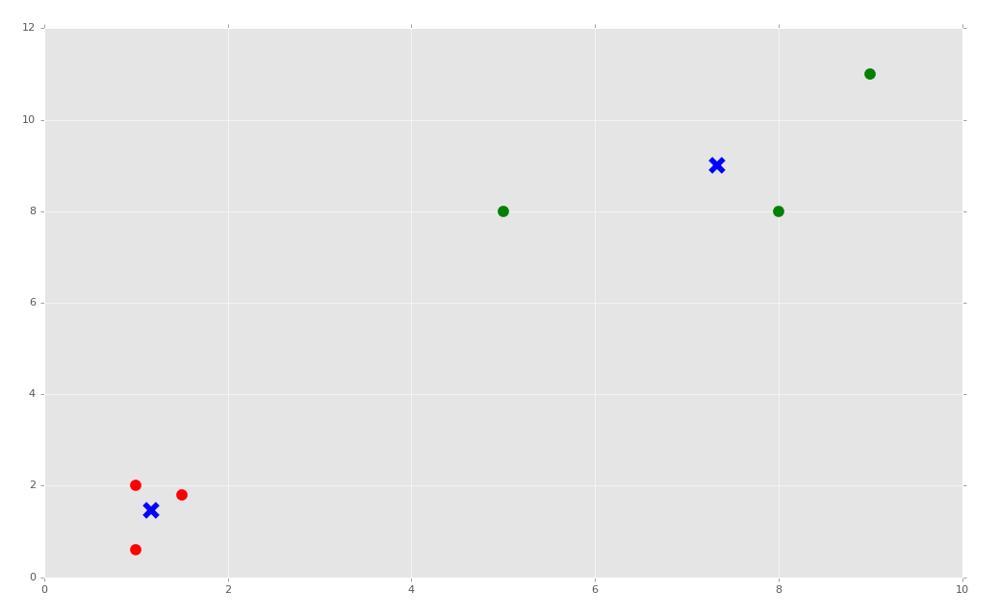

# 第三十四章 聚类简介

> 原文：[Machine Learning - Clustering Introduction](https://pythonprogramming.net/machine-learning-clustering-introduction-machine-learning-tutorial/)

> 译者：[飞龙](https://github.com/wizardforcel)

> 协议：[CC BY-NC-SA 4.0](http://creativecommons.org/licenses/by-nc-sa/4.0/)

欢迎阅读第三十四篇教程。这篇教程是聚类和非监督机器学习的开始。到现在为止，每个我们涉及到的东西都是“监督”机器学习，也就是说，我们科学家，告诉机器特征集有什么分类。但是在非监督机器学习下，科学家的角色就溢出了。首先，我们会涉及聚类，它有两种形式，扁平和层次化的。

对于这两种形式的聚类，机器的任务是，接受仅仅是特征集的数据集，之后搜索分组并分配标签。对于扁平化聚类，科学家告诉机器要寻找多少个分类或簇。对于层次化聚类，机器会自己寻找分组及其数量。

我们为什么要利用聚类呢？聚类的目标就是寻找数据中的关系和含义。多数情况下，我自己看到了，人们将聚类用于所谓的“半监督”机器学习。这里的想法是，你可以使用聚类来定义分类。另一个用途就是特征选取和验证。例如，考虑我们的乳腺肿瘤数据集。我们可能认为，我们选取的特征缺失是描述性并且有意义的。我们拥有的一个选项，就是将数据扔给 KMeans 算法，之后观察数据实际上是否描述了我们跟踪的两个分组，以我们预期的方式。

下面假设，你是个 Amazon 的树科学家。你的 CTO 收集了数据，并且认为可以用于预测顾客是不是买家。它们希望你使用 KMeans 来看看是否 KMeans 正确按照数据来组织用户，CTO 认为这个很有意义。

层次聚类是什么？假设你仍然是那个相同的数据科学家。这一次，你使用层次聚类算法处理看似有意义的数据，例如均值漂移，并且实际上获取了五个分组。在深入分析之后，你意识到访问者实际上不是买家或者非买家，它们实际上是个光谱。实际上有非买家、可能的非买家、低可能的买家、高可能的马甲，和确定的买家。

聚类也可以用于真正的未知数据，来尝试寻找结构。假设你是个探索北美人类文字的外星人。你可能收集了所有手写字符，将其编译为一个大型的特征列表。之后你可能将这个列表扔给层次聚类算法，来看看是否可以寻找特定的分组，以便通过字符解码语言。

“大数据分析”的领域通常是聚类的初始区域。这里有大量的数据，但是如何处理他们，或者如何获取他们的含义，多数公司完全没有概念。聚类可以帮助数据科学家，来分析大量数据集的结构，以及寻找它们的含义。

最后，聚类也可以用于典型的分类，你实际上并不需要将其扔给分类算法，但是如果你在多数主流的分类数据集上使用聚类，你应该能发现，它能够找到分组。

我们第一个算法是 KMeans。KMeans 的思路就是尝试将给定数据集聚类到 K 个簇中。它的工作方式令人印象深刻。并且我们足够幸运，他还非常简单。这个过程是：

1.  获取真个数据集，并随机设置 K 个形心。形心就是簇的“中心”。首先，我通常选取前 K 个值，并使用它们来开始，但是你也可以随机选取它们。这应该没关系，但是，如果你不为了一些原因做优化，可能就需要尝试打乱数据并再次尝试。

2.  计算每个数据集到形心的距离，1并按照形心的接近程度来分类每个数据集。形心的分类是任意的，你可能将第一个形心命名为 0，第二个为 1，以此类推。

3.  一旦已经分类好了数据，现在计算分组的均值，并将均值设为新的形心。

4.  重复第二和第三步直到最优。通常，你通过形心的移动来度量优化。有很多方式来这么做，我们仅仅使用百分数比例。

很简单，比 SVM 简单多了。让我们看看一个简短的代码示例。开始，我们拥有这样一些数据：

```py
import matplotlib.pyplot as plt
from matplotlib import style
import numpy as np
from sklearn.cluster import KMeans
style.use('ggplot')

#ORIGINAL:

X = np.array([[1, 2],
              [1.5, 1.8],
              [5, 8],
              [8, 8],
              [1, 0.6],
              [9, 11]])


plt.scatter(X[:, 0],X[:, 1], s=150, linewidths = 5, zorder = 10)
plt.show()
```

我们的数据是：


太棒了，看起来很简单，所以我们的 KMeans 算法更适于这个东西。首先我们会尝试拟合所有东西：

```py
clf = KMeans(n_clusters=2)
clf.fit(X)
```

就这么简单，但是我们可能希望看到它。我们之前在 SVM 中看到过，多数 Sklearn 分类器都拥有多种属性。使用 KMeans 算法，我们可以获取形心和标签。

```py
centroids = clf.cluster_centers_
labels = clf.labels_
```

现在绘制他们：

```py
colors = ["g.","r.","c.","y."]
for i in range(len(X)):
    plt.plot(X[i][0], X[i][1], colors[labels[i]], markersize = 10)
plt.scatter(centroids[:, 0],centroids[:, 1], marker = "x", s=150, linewidths = 5, zorder = 10)
plt.show()
```



下面，我们打算讲 KMeans 算法应用于真实的数据集，并且涉及，如果你的数据含有非数值的信息，会发生什么。
