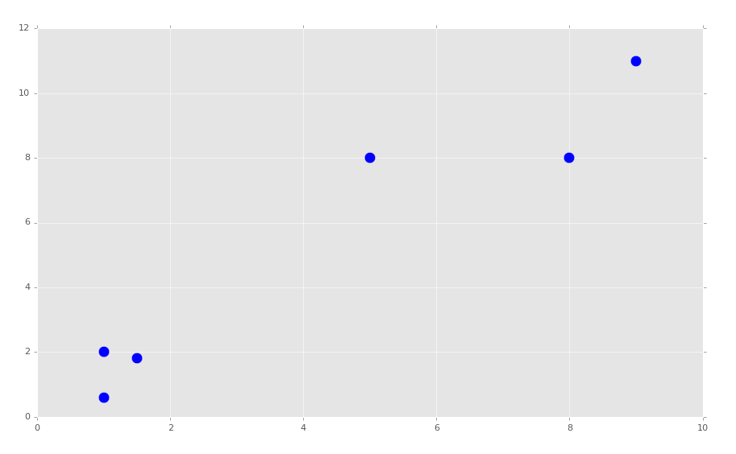

# 第三十七章 使用 Python 从零实现 KMeans

> 原文：[K-Means from Scratch in Python](https://pythonprogramming.net/k-means-from-scratch-machine-learning-tutorial/)

> 译者：[飞龙](https://github.com/wizardforcel)

> 协议：[CC BY-NC-SA 4.0](http://creativecommons.org/licenses/by-nc-sa/4.0/)

欢迎阅读第三十七篇教程，这是另一篇聚类的教程。

这个教程中，我们打算从零构建我们自己的 KMeans 算法。之前提到过 KMeans 算法的步骤。

1.  选择 K 值。
2.  随机选取 K 个特征作为形心。
3.  计算所有其它特征到形心的距离。
4.  将其它特征分类到最近的形心。
5.  计算每个分类的均值（分类中所有特征的均值），使均值为新的形心。
6.  重复步骤 3 ~ 5，直到最优（形心不再变化）。

最开始，我们：

```py
import matplotlib.pyplot as plt
from matplotlib import style
style.use('ggplot')
import numpy as np

X = np.array([[1, 2],
              [1.5, 1.8],
              [5, 8 ],
              [8, 8],
              [1, 0.6],
              [9,11]])

plt.scatter(X[:,0], X[:,1], s=150)
plt.show()
```



我们的簇应该很显然了。我们打算选取`K=2`。我们开始构建我们的 KMeans 分类：

```py
class K_Means:
    def __init__(self, k=2, tol=0.001, max_iter=300):
        self.k = k
        self.tol = tol
        self.max_iter = max_iter
```

我们刚刚配置了一些起始值，`k`就是簇的数量，`tol`就是容差，如果簇的形心移动没有超过这个值，就是最优的。`max_iter`值用于限制循环次数。

现在我们开始处理`fit`方法：

```py
    def fit(self,data):

        self.centroids = {}

        for i in range(self.k):
            self.centroids[i] = data[i]
```

最开始，我们知道我们仅仅需要传入拟合数据。之后我们以空字典开始，它之后会存放我们的形心。下面，我们开始循环，仅仅将我们的起始形心赋为数据中的前两个样例。如果你打算真正随机选取形心，你应该首先打乱数据，但是这样也不错。

继续构建我们的类：

```py
class K_Means:
    def __init__(self, k=2, tol=0.001, max_iter=300):
        self.k = k
        self.tol = tol
        self.max_iter = max_iter

    def fit(self,data):

        self.centroids = {}

        for i in range(self.k):
            self.centroids[i] = data[i]

        for i in range(self.max_iter):
            self.classifications = {}

            for i in range(self.k):
                self.classifications[i] = []
```
现在我们开始迭代我们的`max_iter`值。这里，我们以空分类开始，之后创建两个字典的键（通过遍历`self.k`的范围）。

下面，我们需要遍历我们的特征，计算当前形心个特征的距离，之后分类他们：

```py
class K_Means:
    def __init__(self, k=2, tol=0.001, max_iter=300):
        self.k = k
        self.tol = tol
        self.max_iter = max_iter

    def fit(self,data):

        self.centroids = {}

        for i in range(self.k):
            self.centroids[i] = data[i]

        for i in range(self.max_iter):
            self.classifications = {}

            for i in range(self.k):
                self.classifications[i] = []

            for featureset in data:
                distances = [np.linalg.norm(featureset-self.centroids[centroid]) for centroid in self.centroids]
                classification = distances.index(min(distances))
                self.classifications[classification].append(featureset)
```

下面，我们需要创建新的形心，并且度量形心的移动。如果移动小于我们的容差（`sel.tol`），我们就完成了。包括添加的代码，目前为止的代码为：

```py
import matplotlib.pyplot as plt
from matplotlib import style
style.use('ggplot')
import numpy as np

X = np.array([[1, 2],
              [1.5, 1.8],
              [5, 8 ],
              [8, 8],
              [1, 0.6],
              [9,11]])

plt.scatter(X[:,0], X[:,1], s=150)
plt.show()

colors = 10*["g","r","c","b","k"]


class K_Means:
    def __init__(self, k=2, tol=0.001, max_iter=300):
        self.k = k
        self.tol = tol
        self.max_iter = max_iter

    def fit(self,data):

        self.centroids = {}

        for i in range(self.k):
            self.centroids[i] = data[i]

        for i in range(self.max_iter):
            self.classifications = {}

            for i in range(self.k):
                self.classifications[i] = []

            for featureset in data:
                distances = [np.linalg.norm(featureset-self.centroids[centroid]) for centroid in self.centroids]
                classification = distances.index(min(distances))
                self.classifications[classification].append(featureset)

            prev_centroids = dict(self.centroids)

            for classification in self.classifications:
                self.centroids[classification] = np.average(self.classifications[classification],axis=0)
```

下一篇教程中，我们会完成我们的类，并看看它表现如何。
