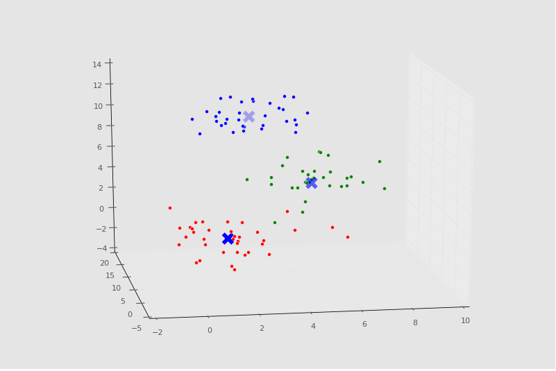

# 第三十九章 均值漂移，层次聚类

> 原文：[Hierarchical Clustering with Mean Shift Introduction](https://pythonprogramming.net/hierarchical-clustering-mean-shift-machine-learning-tutorial/)

> 译者：[飞龙](https://github.com/wizardforcel)

> 协议：[CC BY-NC-SA 4.0](http://creativecommons.org/licenses/by-nc-sa/4.0/)

欢迎阅读第三十九篇教程，另一片聚类的教程，我们使用均值漂移算法，继续探讨聚类和非监督机器学习的话题。

均值漂移非常类似于 KMeans 算法，除了一个很重要的因素，你不需要指定分组的数量。均质漂亮算法自己寻找簇。出于这个原因，它比起 KMeans，更加是一种“非监督”的机器学习的算法。

均值漂移的方式就是遍历每个特征集（图上的数据点），并且执行登山的操作。登山就像它的名字，思想是持续底层，或者向上走，直到到达了顶部。我们不确定只有一个局部最大值。我们可能拥有一个，也可能拥有是个。这里我们的“山”就是给定半径内的特征集或数据点数量。半径也叫作贷款，整个窗口就是你的核。窗口中的数据越多，就越好。一旦我们不再执行另一个步骤，来降低半径内的特征集或者数据点的数量时，我们就选取该区域内所有数据的均值，然后就有了簇的中心。我们从每个数据点开始这样做。许多数据点都会产生相同的簇中心，这应该是预料中的，但是其他数据点也可能有完全不同的簇中心。

但是，你应该开始认识到这个操作的主要弊端：规模。规模看似是一个永久的问题。所以我们从每个数据点开始运行这个优化算法，这很糟糕，我们可以使用一些方法来加速这个过程，但是无论怎么样，这个算法仍然开销很大。

虽然这个方法是层次聚类方法，你的核可以是扁平的，或者高斯核。要记住这个核就是你的窗口，在寻找均值时，我们可以让每个特征集拥有相同权重（扁平核），或者通过核中心的接近性来分配权重（高斯核）。

均值漂移用于什么呢？核之前提到的聚类相比，均值漂移在图像分析的跟踪和平滑中很热门。现在，我们打算仅仅专注于我们的特征集聚类。

现在为止，我们涉及了使用 Sklearn 和 Matplotlib 可视化的基础，以及分类器的属性。所以我直接贴出了代码：

```py
import numpy as np
from sklearn.cluster import MeanShift
from sklearn.datasets.samples_generator import make_blobs
import matplotlib.pyplot as plt
from mpl_toolkits.mplot3d import Axes3D
from matplotlib import style
style.use("ggplot")

centers = [[1,1,1],[5,5,5],[3,10,10]]

X, _ = make_blobs(n_samples = 100, centers = centers, cluster_std = 1.5)

ms = MeanShift()
ms.fit(X)
labels = ms.labels_
cluster_centers = ms.cluster_centers_

print(cluster_centers)
n_clusters_ = len(np.unique(labels))
print("Number of estimated clusters:", n_clusters_)

colors = 10*['r','g','b','c','k','y','m']
fig = plt.figure()
ax = fig.add_subplot(111, projection='3d')

for i in range(len(X)):
    ax.scatter(X[i][0], X[i][1], X[i][2], c=colors[labels[i]], marker='o')

ax.scatter(cluster_centers[:,0],cluster_centers[:,1],cluster_centers[:,2],
            marker="x",color='k', s=150, linewidths = 5, zorder=10)

plt.show()
```

控制台输出：

```
[[  1.26113946   1.24675516   1.04657994]
 [  4.87468691   4.88157787   5.15456168]
 [  2.77026724  10.3096062   10.40855045]]
Number of estimated clusters: 3
```

绘图：


