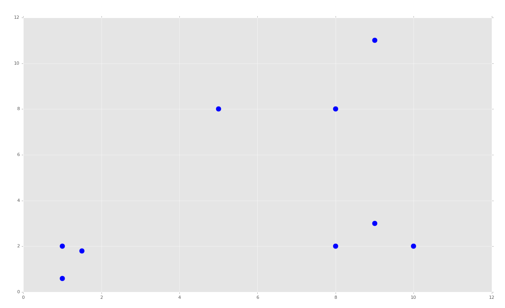

# 第四十一章 从零编写均值漂移

> 原文：[Mean Shift algorithm from scratch in Python
](https://pythonprogramming.net/mean-shift-from-scratch-python-machine-learning-tutorial/)

> 译者：[飞龙](https://github.com/wizardforcel)

> 协议：[CC BY-NC-SA 4.0](http://creativecommons.org/licenses/by-nc-sa/4.0/)

欢迎阅读第四十一篇教程，这是另一篇聚类教程。

这篇教程中，我们从零开始构建我们自己的均值漂移算法。首先，我们会以一些 37 章中的代码开始，它就是我们开始构建 KMeans 算法的地方。我会向原始原始数据添加更多簇或者分组。你可以添加新的数据，或者保留原样。

```py
import matplotlib.pyplot as plt
from matplotlib import style
style.use('ggplot')
import numpy as np

X = np.array([[1, 2],
              [1.5, 1.8],
              [5, 8 ],
              [8, 8],
              [1, 0.6],
              [9,11],
              [8,2],
              [10,2],
              [9,3],])

plt.scatter(X[:,0], X[:,1], s=150)
plt.show()

colors = 10*["g","r","c","b","k"]
```

运行之后，代码会生成：



就像 KMeans 那部分，这会创建明显的分组。对于 KMeans，我们告诉机器我们想要 K（2）个簇。对于均值漂移，我们希望机器自己识别出来，并且对于我们来说，我们希望有三个分组。

我们开始我们的`MeanShift`类：

```py
class Mean_Shift:
    def __init__(self, radius=4):
        self.radius = radius
```

我们会以半径 4 开始，因为我们可以估计出，半径 4 是有意义的。这就是我们在初始化方法中需要的所有东西。我们来看看`fit`方法：

```py
    def fit(self, data):
        centroids = {}

        for i in range(len(data)):
            centroids[i] = data[i]
```

这里，我们开始创建起始形心。均值漂移的方法是：

1.  让所有数据点都是形心。
2.  计算形心半径内的所有数据集，将均值设置为新的形心。
3.  重复步骤 2 直至收敛。

目前为止，我们完成了步骤 1，现在需要重复步骤 2 直到收敛。

```py
        while True:
            new_centroids = []
            for i in centroids:
                in_bandwidth = []
                centroid = centroids[i]
                for featureset in data:
                    if np.linalg.norm(featureset-centroid) < self.radius:
                        in_bandwidth.append(featureset)

                new_centroid = np.average(in_bandwidth,axis=0)
                new_centroids.append(tuple(new_centroid))

            uniques = sorted(list(set(new_centroids)))
```

这里，我们开始迭代每个形心，并且找到范围内的所有特征集。这里，我们计算了均值，并将均值设置为新的形心。最后，我们创建`unique`变量，它跟踪了所有已知形心的排序后的列表。我们这里使用`set`，因为它们可能重复，重复的形心也就是同一个形心。

我们来完成`fit`方法：

```py
            prev_centroids = dict(centroids)

            centroids = {}
            for i in range(len(uniques)):
                centroids[i] = np.array(uniques[i])

            optimized = True

            for i in centroids:
                if not np.array_equal(centroids[i], prev_centroids[i]):
                    optimized = False
                if not optimized:
                    break
                
            if optimized:
                break

        self.centroids = centroids
```

这里我们注意到之前的形心，之后，我们重置“当前”或者“新的”形心，通过将其去重。最后，我们比较了之前的形心和新的形心，并度量了移动。如果任何形心发生了移动，就不是完全收敛和最优化，我们就需要继续执行另一个循环。如果它是最优化的，我们就终端，之后将`centroids`属性设置为我们生成的最后一个形心。

我们现在可以将这个第一个部分，以及类包装起来，添加下面这些东西：

```py
clf = Mean_Shift()
clf.fit(X)

centroids = clf.centroids

plt.scatter(X[:,0], X[:,1], s=150)

for c in centroids:
    plt.scatter(centroids[c][0], centroids[c][1], color='k', marker='*', s=150)

plt.show()
```


目前为止的完整代码：

```py
import matplotlib.pyplot as plt
from matplotlib import style
style.use('ggplot')
import numpy as np

X = np.array([[1, 2],
              [1.5, 1.8],
              [5, 8 ],
              [8, 8],
              [1, 0.6],
              [9,11],
              [8,2],
              [10,2],
              [9,3],])

##plt.scatter(X[:,0], X[:,1], s=150)
##plt.show()

colors = 10*["g","r","c","b","k"]

class Mean_Shift:
    def __init__(self, radius=4):
        self.radius = radius

    def fit(self, data):
        centroids = {}

        for i in range(len(data)):
            centroids[i] = data[i]
        
        while True:
            new_centroids = []
            for i in centroids:
                in_bandwidth = []
                centroid = centroids[i]
                for featureset in data:
                    if np.linalg.norm(featureset-centroid) < self.radius:
                        in_bandwidth.append(featureset)

                new_centroid = np.average(in_bandwidth,axis=0)
                new_centroids.append(tuple(new_centroid))

            uniques = sorted(list(set(new_centroids)))

            prev_centroids = dict(centroids)

            centroids = {}
            for i in range(len(uniques)):
                centroids[i] = np.array(uniques[i])

            optimized = True

            for i in centroids:
                if not np.array_equal(centroids[i], prev_centroids[i]):
                    optimized = False
                if not optimized:
                    break
                
            if optimized:
                break

        self.centroids = centroids


clf = Mean_Shift()
clf.fit(X)

centroids = clf.centroids

plt.scatter(X[:,0], X[:,1], s=150)

for c in centroids:
    plt.scatter(centroids[c][0], centroids[c][1], color='k', marker='*', s=150)

plt.show()
```

到这里，我们获取了所需的形心，并且我们觉得十分聪明。从此，所有我们所需的就是计算欧氏距离，并且我们拥有了形心和分类。预测就变得简单了。现在只有一个问题：半径。

我们基本上硬编码了半径。我看了数据集之后才决定 4 是个好的数值。这一点也不动态，并且它不像是非监督机器学习。假设如果我们有 50 个维度呢？就不会很简单了。机器能够观察数据集并得出合理的值吗？我们会在下一个教程中涉及它。
