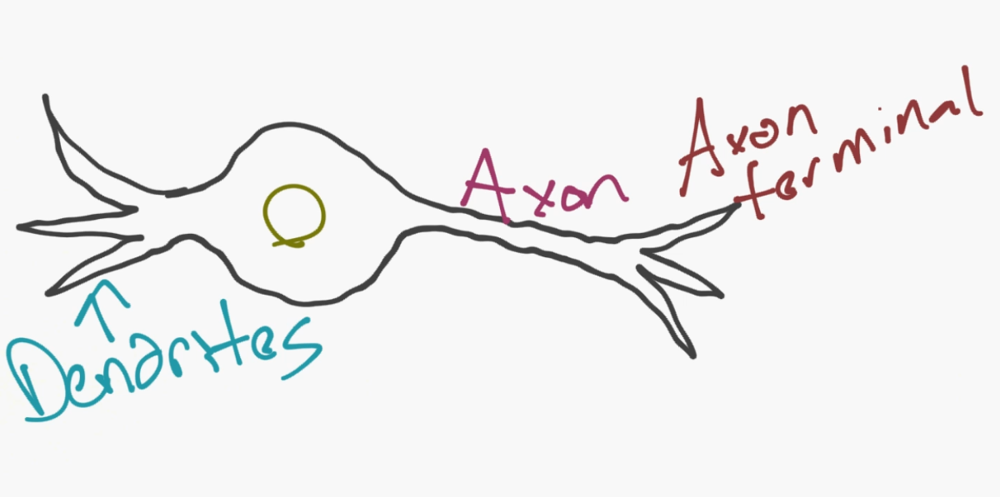
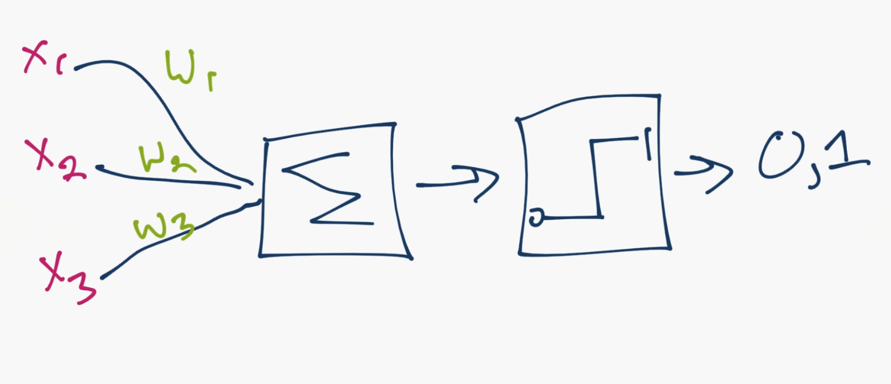
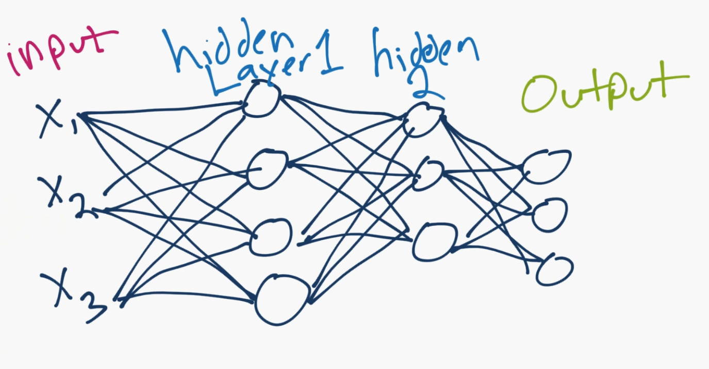

# 第四十三章 神经网络简介

> 原文：[Introduction to Neural Networks](https://pythonprogramming.net/neural-networks-machine-learning-tutorial/)

> 译者：[飞龙](https://github.com/wizardforcel)

> 协议：[CC BY-NC-SA 4.0](http://creativecommons.org/licenses/by-nc-sa/4.0/)

欢迎阅读机器学习系列教程的一个新部分：深度学习和神经网络、以及 TensorFlow。人造的神经网络受生物学启发，用于指导机器学习，刻意模拟你的大脑（生物神经网络）。

人造神经网络是个新的概念，我现在将其用神经网络来指代。这个概念刻意追溯到 20 世纪 40 年代，并且有数次波动，尤其是跟支持向量机来比较。例如，神经网络直到 90 年代中期才流行，同时 SVM 使用一种新公开的技术（技术在应用之前经过了很长时间），“核的技巧”，适用于非线性分隔的数据集。有了它，SVM 再次流行起来，将神经网络和很多有趣的东西遗留在了后面，直到 2011 年。由于大量的可用数据集，以及更加强大的计算机，这个时候神经网络使用新的技巧，开始优于 SVM。

这就是为什么，如果你打算致力于机器学习领域，理解其它模型也是很重要的，因为趋势可以或者的确改变了。既然我们有了一些机器，它们能够实际执行神经网络，我们就有了一个有些有趣的情况，因为人们一直坐着，一直琢磨这个话题已经有十年了。这并不是说，发表神经研究的论文的人很少见，并且有些具体话题的论文在十年前就写完了。

神经网络的模型实际上是个非常简单的概念。这个概念就是模拟神经元（neuron），并且对于一个基本的神经元，它有树突（dendrites）、细胞核、轴突（axon）和轴突末梢（axon terminal）。

然后，对于一个网络，你需要两个神经元。神经元通过树突和轴突末梢之间的突触（synapse）来传递信息。

好的，所以这就是神经元的工作方式。现在计算机科学家认为我们可以用这个。所以我们提出了一个人造神经元的模型：

就是这样。所以你和你的神经元很像了。虽然，我们进一步简化了事情，并且如果你搜索神经网络的图片，你可能看到这个：

那个圆圈就是神经元或者节点，它们带有数据上的函数，并且互相连接的线是所传递的权重或者信息。每一列都是一个层。你的数据的第一层是输入层。之后，除非你的输出就是你的输入，你拥有至少一个隐藏层。如果你只有一个隐藏层，你就有了一个常规的人造神经网络。如果你拥有多个隐藏层，你就有了深度神经网络，是不是很简单呢？至少是概念上。

所以对于这个模型，你拥有输入数据，对其加权，并且将其传给神经元中的函数。神经元中的函数是个阈值函数，也叫作激活函数。基本上，它是使用一个高于或者低于特定值加权之后的总合。如果它是，你就可以得到一个信号（1），或者什么都没有（0）。然后它加权并且转给下一个神经元，并且执行同样的函数。

这就是一个神经网络模型。所以，什么是权重和阈值函数呢？首先，多亏了 1974 的 Paul Werbos，我们去掉了阈值“变量”。我们不将这些阈值处理为另一个要优化的变量，而是选取然后阈值的值，将其权重为 -1，阈值总是为0,。无论阈值有多大，它都会自行消除，并且始终为 0。我们仍然有一个丑陋的步骤函数，因为神经元产生 0 还是 1 的决策是非常混乱的。我们决定使用某种类型的 sigmoid 函数（S 形）来代替。

对于权重，它们只是随机启动，并且它们对于每个输入到节点/神经元是唯一的。 然后，在典型的“前馈”（最基本的类型）神经网络中，你的信息通过你创建的网络直接传递，并使用你的样本数据，将输出与期望输出进行比较。 从这里，你需要调整权重，来帮助你获得与预期输出匹配的输出。 直接通过神经网络发送数据的行为称为前馈神经网络。 我们的数据从输入层到隐藏层，然后是输出层。 当我们向后退，开始调整权重来最小化损失/成本时，这称为反向传播。

这是一个新的优化问题。 回忆一下，几个教程之前的支持向量机优化问题，我们如何解释这是一个很好的凸优化问题。 即使我们有两个变量，我们的优化问题是一个完美的碗形，所以我们可以知道什么时候达到了最优化，同时沿着路径执行了大量的步骤，使处理便宜。 使用神经网络，情况并非如此。 在实际中，你寻找更多成千上万个变量，甚至数百万或更多的变量。这里的原始解决方案是使用随机梯度下降，但还有其他选项，如 AdaGrad 和 Adam Optimizer。无论如何，这是一项巨大的计算任务。

现在你可以看到为什么神经网络几乎已经搁置了半个多世纪。 只是最近，我们才拥有了这种能力和架构的机器，以便执行这些操作，以及用于匹配的适当大小的数据集。 好消息是，我们已经有花个世纪来就这个话题进行哲学思考，而且大量的基础工作已经完成了，只需要实施和测试。

有意思的是，正如我们不完全了解人类大脑一样，我们并不完全理解神经网络为什么或如何实现这样有趣的结果。 通过大量的挖掘和分析，我们可以揭开一些事情，但是由于许多变量和维度，我们实际上并不太了解发生了什么，我们只是看到了很好的结果，并且很开心。 即使是我们的第一个例子，原则上也是非常基本的，但是他做的事情也有惊人的结果。

对于简单的分类任务，神经网络在性能上与其他简单算法相对接近，甚至像 KNN 那样。 神经网络中的真正美丽带来了更大的数据，更复杂的问题，这两个都使其他机器学习模型变得无力。 例如，当前的神经网络可以做出如下回答：

> Jack 12 岁，Jane 10 岁，Kate 比 Jane 年长，比 Jack 年轻，Kate 多少岁？

答案是11，一个深度学习模型可以解释出来，无需你在某种程度上教会如何实际完成逻辑部分。 你只需简单地传递原始数据，它是单词，甚至是字符，而神经网络则完成其余部分。 哦，你需要数百万个样例！ 以数百万计，我的意思是为了理想的准确度需要约 5 亿。

你在哪里得到数以百万计的样品？你有一些选择。图像数据的一个选择是 [ImageNet](https://image-net.org/)，它在事物的组织中非常类似于 wordnet。如果你不熟悉，你可以提出一个想法。这里的一切都是免费的。接下来，对于文本数据，第一个站点应该是像[维基百科数据转储](https://dumps.wikimedia.org/backup-index.html)。这对于更多的深度学习的任务非常有用，而不是标签数据。接下来，对于更多的文本数据，为什么不去已经被爬去和解析的大部分网站呢？如果这听起来很有趣，请查看 [CommonCrawl](https://commoncrawl.org/)。这个数据集不是一个笑话，但是它的数据是 PB 级的。对于演讲，我并没有很多思路。一个选项是像 [Tatoeba](https://tatoeba.org/eng/)，它有标签和一些翻译，这是非常有用的。当一切都失败时，你可以尝试创建自己的数据集，但是大小要求相当有挑战性。另外，你可以随时寻求帮助。根据我的经验，存在任何东西的数据集，你只需要找到它。很多时候，Google 在尝试查找数据集时会失败，但是人们可以帮助你。目前，你可以在[机器学习 subreddit](https://www.reddit.com/r/machinelearning/) 中尝试询问，大概 90% 的内容与神经网络相关，每个人都需要了解大量的数据集。

现在应该比较明显的是，像 Facebook 和 Google 这样的公司，对于 AI 和神经网络的投入如此之大。 他们实际上拥有所需的数据量来做一些非常有趣的事情。

现在我们有这样的方式，我们如何在神经网络上工作？ 我们将使用 TensorFlow，这是 Google 的一个相对较新的软件包，在撰写本文时仍然是测试版。 还有其他用于机器学习的包，如 Theano 或 Torch，但它们都以类似的方式工作。 我们真的只需要选一个，我选择 Tensorflow。 在下一个教程中，我们将安装 TensorFlow。 如果你已经安装了 TensorFlow，可以跳过下一个教程（使用侧面导航栏，或者单击下一步，滚动到底部，然后再次单击）。
