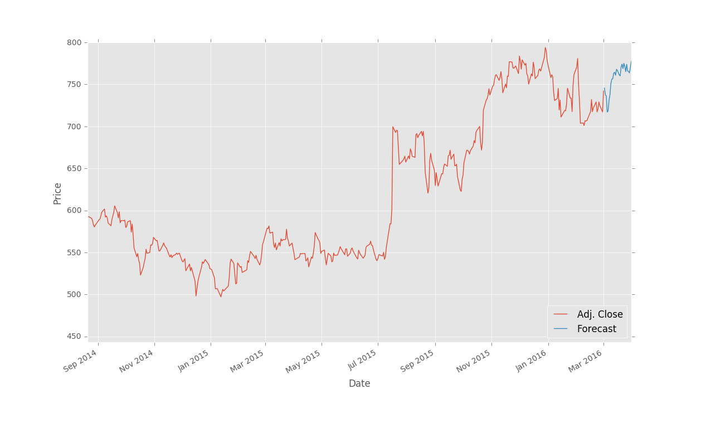

# 第五章 预测

> 原文：[Regression - Forecasting and Predicting](https://pythonprogramming.net/forecasting-predicting-machine-learning-tutorial/)

> 译者：[飞龙](https://github.com/)

> 协议：[CC BY-NC-SA 4.0](http://creativecommons.org/licenses/by-nc-sa/4.0/)

欢迎阅读机器学习系列教程的第五章，当前涉及到回归。目前为止，我们收集并修改了数据，训练并测试了分类器。这一章中，我们打算使用我们的份额利器来实际做一些预测。我们目前所使用的代码为：

```py
import quandl, math
import numpy as np
import pandas as pd
from sklearn import preprocessing, cross_validation, svm
from sklearn.linear_model import LinearRegression

df = quandl.get("WIKI/GOOGL")
df = df[['Adj. Open',  'Adj. High',  'Adj. Low',  'Adj. Close', 'Adj. Volume']]
df['HL_PCT'] = (df['Adj. High'] - df['Adj. Low']) / df['Adj. Close'] * 100.0
df['PCT_change'] = (df['Adj. Close'] - df['Adj. Open']) / df['Adj. Open'] * 100.0

df = df[['Adj. Close', 'HL_PCT', 'PCT_change', 'Adj. Volume']]
forecast_col = 'Adj. Close'
df.fillna(value=-99999, inplace=True)
forecast_out = int(math.ceil(0.01 * len(df)))
df['label'] = df[forecast_col].shift(-forecast_out)

X = np.array(df.drop(['label'], 1))
X = preprocessing.scale(X)
X = X[:-forecast_out]
df.dropna(inplace=True)
y = np.array(df['label'])
X_train, X_test, y_train, y_test = cross_validation.train_test_split(X, y, test_size=0.2)

clf = LinearRegression(n_jobs=-1)
clf.fit(X_train, y_train)
confidence = clf.score(X_test, y_test)
print(confidence)
```

我会强调，准确率大于 95% 的线性模型并不是那么好。我当然不会用它来交易股票。仍然有一些需要考虑的问题，特别是不同公司有不同的价格轨迹。Google 非常线性，向右上角移动，许多公司不是这样，所以要记住。现在，为了做预测，我们需要一些数据。我们决定预测 1% 的数据，因此我们打算，或者至少能够预测数据集的后 1%。所以我们什么可以这样做呢？我们什么时候可以识别这些数据？我们现在就可以，但是要注意我们尝试预测的数据，并没有像训练集那样缩放。好的，那么做什么呢？是否要对后 1% 调用`preprocessing.scale()`？缩放方法基于所有给它的已知数据集。理想情况下，你应该一同缩放训练集、测试集和用于预测的数据。这永远是可能或合理的嘛？不是，如果你可以这么做，你就应该这么做。但是，我们这里，我们可以这么做。我们的数据足够小，并且处理时间足够低，所以我们会一次性预处理并缩放数据。

在许多例子中，你不能这么做。想象如果你使用几个 GB 的数据来训练分类器。训练分类器会花费几天，不能在每次想要做出预测的时候都这么做。因此，你可能需要不缩放任何东西，或者单独缩放数据。通常，你可能希望测试这两个选项，并看看那个对于你的特定案例更好。

要记住它，让我们在定义`X`的时候处理所有行：

```py
X = np.array(df.drop(['label'], 1))
X = preprocessing.scale(X)
X_lately = X[-forecast_out:]
X = X[:-forecast_out]

df.dropna(inplace=True)

y = np.array(df['label'])

X_train, X_test, y_train, y_test = cross_validation.train_test_split(X, y, test_size=0.2)
clf = LinearRegression(n_jobs=-1)
clf.fit(X_train, y_train)
confidence = clf.score(X_test, y_test)
print(confidence)
```

要注意我们首先获取所有数据，预处理，之后再分割。我们的`X_lately`变量包含最近的特征，我们需要对其进行预测。目前你可以看到，定义分类器、训练、和测试都非常简单。预测也非常简单：

```py
forecast_set = clf.predict(X_lately)
```

`forecast_set `是预测值的数组，表明你不仅仅可以做出单个预测，还可以一次性预测多个值。看看我们目前拥有什么：

```
[ 745.67829395  737.55633261  736.32921413  717.03929303  718.59047951
  731.26376715  737.84381394  751.28161162  756.31775293  756.76751056
  763.20185946  764.52651181  760.91320031  768.0072636   766.67038016
  763.83749414  761.36173409  760.08514166  770.61581391  774.13939706
  768.78733341  775.04458624  771.10782342  765.13955723  773.93369548
  766.05507556  765.4984563   763.59630529  770.0057166   777.60915879] 0.956987938167 30
```

所以这些就是我们的预测结果，然后呢？已经基本完成了，但是我们可以将其可视化。股票价格是每一天的，一周 5 天，周末没有。我知道这个事实，但是我们打算将其简化，把每个预测值当成每一天的。如果你打算处理周末的间隔（不要忘了假期），就去做吧，但是我这里会将其简化。最开始，我们添加一些新的导入：

```py
import datetime
import matplotlib.pyplot as plt
from matplotlib import style
```

我导入了`datetime`来处理`datetime`对象，Matplotlib 的`pyplot`包用于绘图，以及`style`来使我们的绘图更加时髦。让我们设置一个样式：


```py
style.use('ggplot')
```

之后，我们添加一个新的列，`forecast`列：


```py
df['Forecast'] = np.nan
```

我们首先将值设置为 NaN，但是我们之后会填充他。

预测集的标签正好从明天开始。因为我们要预测未来`m = 0.1 * len(df)`天的数据，相当于把收盘价往前移动`m`天生成标签。那么数据集的后`m`个是不能用作训练集和测试集的，因为没有标签。于是我们将后`m`个数据用作预测集。预测集的第一个数据，也就是数据集的第`n - m`个数据，它的标签应该是`n - m + m = n`天的收盘价，我们知道今天在`df`里面是第`n - 1`天，那么它就是明天。

我们首先需要抓取 DataFrame 的最后一天，将每一个新的预测值赋给新的日期。我们会这样开始。

```py
last_date = df.iloc[-1].name
last_unix = last_date.timestamp()
one_day = 86400
next_unix = last_unix + one_day
```

现在我们拥有了预测集的起始日期，并且一天有 86400 秒。现在我们将预测添加到现有的 DataFrame 中。

```py
for i in forecast_set:
    next_date = datetime.datetime.fromtimestamp(next_unix)
    next_unix += 86400
    df.loc[next_date] = [np.nan for _ in range(len(df.columns)-1)]+[i]
```

我们这里所做的是，迭代预测集的标签，获取每个预测值和日期，之后将这些值放入 DataFrame（使预测集的特征为 NaN）。最后一行的代码创建 DataFrame 中的一行，所有元素置为 NaN，然后将最后一个元素置为`i`（这里是预测集的标签）。我选择了这种单行的`for`循环，以便在改动 DataFrame 和特征之后，代码还能正常工作。所有东西都做完了吗？将其绘制出来。

```py
df['Adj. Close'].plot()
df['Forecast'].plot()
plt.legend(loc=4)
plt.xlabel('Date')
plt.ylabel('Price')
plt.show()
```

完整的代码：

```py
import Quandl, math
import numpy as np
import pandas as pd
from sklearn import preprocessing, cross_validation, svm
from sklearn.linear_model import LinearRegression
import matplotlib.pyplot as plt
from matplotlib import style
import datetime

style.use('ggplot')

df = Quandl.get("WIKI/GOOGL")
df = df[['Adj. Open',  'Adj. High',  'Adj. Low',  'Adj. Close', 'Adj. Volume']]
df['HL_PCT'] = (df['Adj. High'] - df['Adj. Low']) / df['Adj. Close'] * 100.0
df['PCT_change'] = (df['Adj. Close'] - df['Adj. Open']) / df['Adj. Open'] * 100.0

df = df[['Adj. Close', 'HL_PCT', 'PCT_change', 'Adj. Volume']]
forecast_col = 'Adj. Close'
df.fillna(value=-99999, inplace=True)
forecast_out = int(math.ceil(0.01 * len(df)))
df['label'] = df[forecast_col].shift(-forecast_out)

X = np.array(df.drop(['label'], 1))
X = preprocessing.scale(X)
X_lately = X[-forecast_out:]
X = X[:-forecast_out]

df.dropna(inplace=True)

y = np.array(df['label'])

X_train, X_test, y_train, y_test = cross_validation.train_test_split(X, y, test_size=0.2)
clf = LinearRegression(n_jobs=-1)
clf.fit(X_train, y_train)
confidence = clf.score(X_test, y_test)

forecast_set = clf.predict(X_lately)
df['Forecast'] = np.nan

last_date = df.iloc[-1].name
last_unix = last_date.timestamp()
one_day = 86400
next_unix = last_unix + one_day

for i in forecast_set:
    next_date = datetime.datetime.fromtimestamp(next_unix)
    next_unix += 86400
    df.loc[next_date] = [np.nan for _ in range(len(df.columns)-1)]+[i]

df['Adj. Close'].plot()
df['Forecast'].plot()
plt.legend(loc=4)
plt.xlabel('Date')
plt.ylabel('Price')
plt.show()
```

结果：

