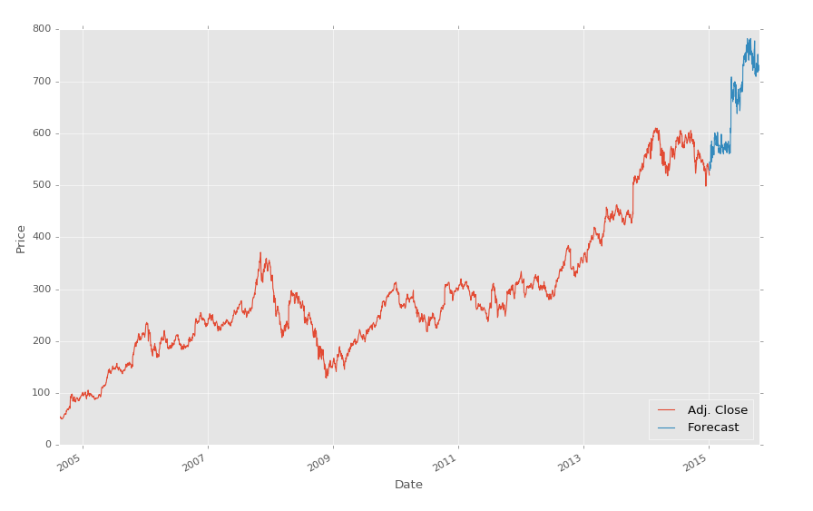

# 第六章 保存和扩展

> 原文：[Pickling and Scaling](https://pythonprogramming.net/pickling-scaling-machine-learning-tutorial/)

> 译者：[飞龙](https://github.com/)

> 协议：[CC BY-NC-SA 4.0](http://creativecommons.org/licenses/by-nc-sa/4.0/)

上一篇教程中，我们使用回归完成了对股票价格的预测，并使用 Matplotlib 可视化。这个教程中，我们会讨论一些接下来的步骤。

我记得我第一次尝试学习机器学习的时候，多数示例仅仅涉及到训练和测试的部分，完全跳过了预测部分。对于那些包含训练、测试和预测部分的教程来说，我没有找到一篇解释保存算法的文章。在那些例子中，数据通常非常小，所以训练、测试和预测过程都很快。在真实世界中，数据都非常大，并且花费更长时间来处理。由于没有一篇教程真正谈论到这一重要的过程，我打算包含一些处理时间和保存算法的信息。

虽然我们的机器学习分类器花费几秒来训练，在一些情况下，训练分类器需要几个小时甚至是几天。想象你想要预测价格的每天都需要这么做。这不是必要的，因为我们呢可以使用 Pickle 模块来保存分类器。首先确保你导入了它：

```py
import pickle
```

使用 Pickle，你可以保存 Python 对象，就像我们的分类器那样。在定义、训练和测试你的分类器之后，添加：

```py
with open('linearregression.pickle','wb') as f:
    pickle.dump(clf, f)
```

现在，再次执行脚本，你应该得到了`linearregression.pickle`，它是分类器的序列化数据。现在，你需要做的所有事情就是加载`pickle`文件，将其保存到`clf`，并照常使用，例如：

```py
pickle_in = open('linearregression.pickle','rb')
clf = pickle.load(pickle_in)
```

代码中：

```py
import Quandl, math
import numpy as np
import pandas as pd
from sklearn import preprocessing, cross_validation, svm
from sklearn.linear_model import LinearRegression
import matplotlib.pyplot as plt
from matplotlib import style
import datetime
import pickle

style.use('ggplot')

df = Quandl.get("WIKI/GOOGL")
df = df[['Adj. Open',  'Adj. High',  'Adj. Low',  'Adj. Close', 'Adj. Volume']]
df['HL_PCT'] = (df['Adj. High'] - df['Adj. Low']) / df['Adj. Close'] * 100.0
df['PCT_change'] = (df['Adj. Close'] - df['Adj. Open']) / df['Adj. Open'] * 100.0

df = df[['Adj. Close', 'HL_PCT', 'PCT_change', 'Adj. Volume']]
forecast_col = 'Adj. Close'
df.fillna(value=-99999, inplace=True)
forecast_out = int(math.ceil(0.1 * len(df)))

df['label'] = df[forecast_col].shift(-forecast_out)

X = np.array(df.drop(['label'], 1))
X = preprocessing.scale(X)
X_lately = X[-forecast_out:]
X = X[:-forecast_out]

df.dropna(inplace=True)

y = np.array(df['label'])

X_train, X_test, y_train, y_test = cross_validation.train_test_split(X, y, test_size=0.2)
#COMMENTED OUT:
##clf = svm.SVR(kernel='linear')
##clf.fit(X_train, y_train)
##confidence = clf.score(X_test, y_test)
##print(confidence)
pickle_in = open('linearregression.pickle','rb')
clf = pickle.load(pickle_in)


forecast_set = clf.predict(X_lately)
df['Forecast'] = np.nan

last_date = df.iloc[-1].name
last_unix = last_date.timestamp()
one_day = 86400
next_unix = last_unix + one_day

for i in forecast_set:
    next_date = datetime.datetime.fromtimestamp(next_unix)
    next_unix += 86400
    df.loc[next_date] = [np.nan for _ in range(len(df.columns)-1)]+[i]
df['Adj. Close'].plot()
df['Forecast'].plot()
plt.legend(loc=4)
plt.xlabel('Date')
plt.ylabel('Price')
plt.show()
```



要注意我们注释掉了分类器的原始定义，并替换为加载我们保存的分类器。就是这么简单。

最后，我们要讨论一下效率和保存时间，前几天我打算提出一个相对较低的范式，这就是临时的超级计算机。严肃地说，随着按需主机服务的兴起，例如 AWS、DO 和 Linode，你能够按照小时来购买主机。虚拟服务器可以在 60 秒内建立，所需的模块可以在 15 分钟内安装，所以非常有限。你可以写一个 shell 脚本或者什么东西来给它加速。考虑你需要大量的处理，并且还没有一台顶级计算机，或者你使用笔记本。没有问题，只需要启动一台服务器。

我对这个方式的最后一个注解是，使用任何主机，你通常都可以建立一个非常小型的服务器，加载所需的东西，之后扩展这个服务器。我喜欢以一个小型服务器开始，之后，我准备好的时候，我会改变它的尺寸，给它升级。完成之后，不要忘了注销或者降级你的服务器。
