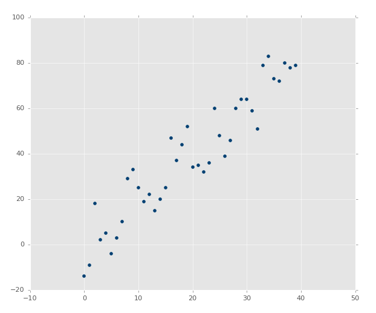
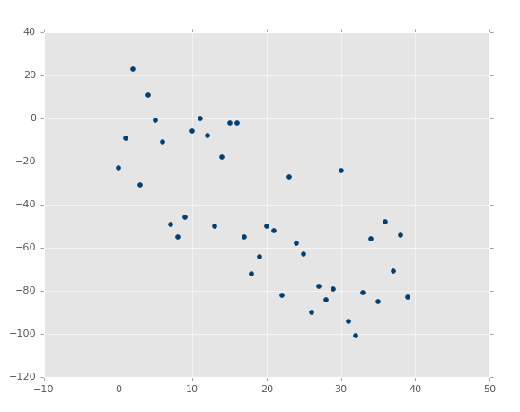

# 第七章 回归 - 理论以及工作原理

> 原文：[Regression - Theory and how it works](https://pythonprogramming.net/simple-linear-regression-machine-learning-tutorial/)

> 译者：[飞龙](https://github.com/wizardforcel)

> 协议：[CC BY-NC-SA 4.0](http://creativecommons.org/licenses/by-nc-sa/4.0/)

欢迎阅读第七篇教程。目前为止，你已经看到了线性回归的价值，以及如何使用 Sklearn 来应用它。现在我们打算深入了解它如何计算。虽然我觉得不必要深入到每个机器学习算法数学中（你有没有进入到你最喜欢的模块的源码中，看看它是如何实现的？），线性代数是机器学习的本质，并且对于理解机器学习的构建基础十分实用。

线性代数的目标是计算向量空间中的点的关系。这可以用于很多事情，但是某天，有个人有了个非常狂野的想法，拿他处理数据集的特征。我们也可以。记得之前我们定义数据类型的时候，线性回归处理连续数据吗？这并不是因为使用线性回归的人，而是因为组成它的数学。简单的线性回归可用于寻找数据集的最佳拟合直线。如果数据不是连续的，就不是最佳拟合直线。让我们看看一些示例。

## 协方差

上面的图像显然拥有良好的协方差。如果你通过估计画一条最佳拟合直线，你应该能够轻易画出来：

如果图像是这样呢？

并不和之前一样，但是是清楚的负相关。你可能能够画出最佳拟合直线，但是更可能画不出来。

最后，这个呢？

啥？的确有最佳拟合直线，但是需要运气将其画出来。

将上面的图像看做特征的图像，所以 X 坐标是特征，Y 坐标是相关的标签。X 和 Y 是否有任何形式的结构化关系呢？虽然我们可以准确计算关系，未来我们就不太可能拥有这么多值了。

在其它图像的案例中，X 和 Y 之间显然存在关系。我们实际上可以探索这种关系，之后沿着我们希望的任何点绘图。我们可以拿 Y 来预测 X，或者拿 X 来预测 Y，对于任何我们可以想到的点。我们也可以预测我们的模型有多少的误差，即使模型只有一个点。我们如何实现这个魔法呢？当然是线性代数。

首先，让我们回到中学，我们在那里复习直线的定义：`y = mx + b`，其中`m`是斜率，`b`是纵截距。这可以是用于求解`y`的方程，我们可以将其变形来求解`x`，使用基本的代数原则：`x = (y-b)/m`。

好的，所以，我们的目标是寻找最佳拟合直线。不是仅仅是拟合良好的直线，而是最好的那条。这条直线的定义就是`y = mx + b`。`y`就是答案（我们其他的坐标，或者甚至是我们的特征），所以我们仍然需要`m`（斜率）和`b`（纵截距），由于`x`可能为沿 x 轴的任一点，所以它是已知的。

最佳拟合直线的斜率`m`定义为：

> 注：可简写为`m = cov(x, y) / var(x)`。

符号上面的横杠代表均值。如果两个符号挨着，就将其相乘。xs 和 ys 是所有已知坐标。所以我们现在求出了`y=mx+b`最佳拟合直线定义的`m`（斜率），现在我们仅仅需要`b`（纵截距）。这里是公式：

好的。整个部分不是个数学教程，而是个编程教程。下一个教程中，我们打算这样做，并且解释为什么我要编程实现它，而不是直接用模块。
