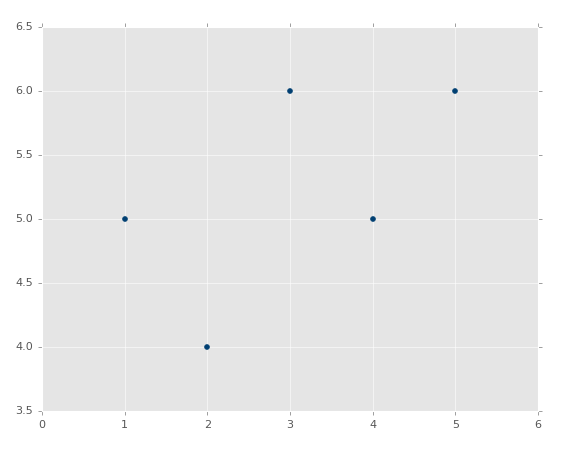
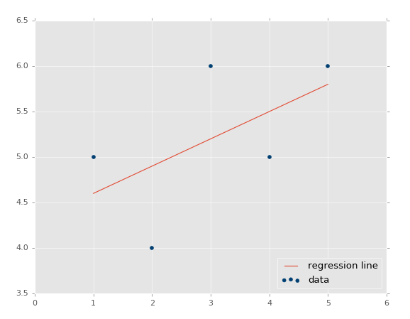
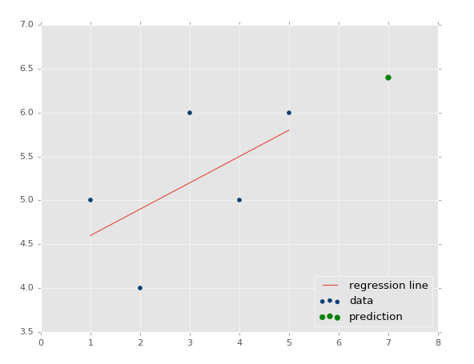

# 第九章 回归 - 计算纵截距

> 原文：[Regression - How to program the Best Fit Line](https://pythonprogramming.net/how-to-program-best-fit-line-machine-learning-tutorial/)

> 译者：[飞龙](https://github.com/wizardforcel)

> 协议：[CC BY-NC-SA 4.0](http://creativecommons.org/licenses/by-nc-sa/4.0/)

欢迎阅读第九篇教程。我们当前正在为给定的数据集，使用 Python 计算回归或者最佳拟合直线。之前，我们编写了一个函数来计算斜率，现在我们需要计算纵截距。我们目前的代码是：

```py
from statistics import mean
import numpy as np

xs = np.array([1,2,3,4,5], dtype=np.float64)
ys = np.array([5,4,6,5,6], dtype=np.float64)

def best_fit_slope(xs,ys):
    m = (((mean(xs)*mean(ys)) - mean(xs*ys)) /
         ((mean(xs)*mean(xs)) - mean(xs*xs)))
    return m

m = best_fit_slope(xs,ys)
print(m)
```

请回忆，最佳拟合直线的纵截距是：


这个比斜率简单多了。我们可以将其写到同一个函数来节省几行代码。我们将函数重命名为`best_fit_slope_and_intercept`。

下面，我们可以填充`b = mean(ys) - (m*mean(xs))`，并返回`m, b`：

```py
def best_fit_slope_and_intercept(xs,ys):
    m = (((mean(xs)*mean(ys)) - mean(xs*ys)) /
         ((mean(xs)*mean(xs)) - mean(xs*xs)))
    
    b = mean(ys) - m*mean(xs)
    
    return m, b
```

现在我们可以调用它：

```py
best_fit_slope_and_intercept(xs,ys)
```

我们目前为止的代码：

```py
from statistics import mean
import numpy as np

xs = np.array([1,2,3,4,5], dtype=np.float64)
ys = np.array([5,4,6,5,6], dtype=np.float64)

def best_fit_slope_and_intercept(xs,ys):
    m = (((mean(xs)*mean(ys)) - mean(xs*ys)) /
         ((mean(xs)*mean(xs)) - mean(xs*xs)))
    
    b = mean(ys) - m*mean(xs)
    
    return m, b

m, b = best_fit_slope_and_intercept(xs,ys)

print(m,b)
# 0.3, 4.3
```

现在我们仅仅需要为数据创建一条直线：



要记住`y=mx+b`，我们能够为此编写一个函数，或者仅仅使用一行的`for`循环。

```py
regression_line = [(m*x)+b for x in xs]
```

上面的一行`for`循环和这个相同：

```py
regression_line = []
for x in xs:
    regression_line.append((m*x)+b)
```

好的，让我们收取我们的劳动果实吧。添加下面的导入：

```py
import matplotlib.pyplot as plt
from matplotlib import style
style.use('ggplot')
```

我们可以绘制图像，并且不会特备难看。现在：

```py
plt.scatter(xs,ys,color='#003F72')
plt.plot(xs, regression_line)
plt.show()
```

首先我们绘制了现有数据的散点图，之后我们绘制了我们的回归直线，之后展示它。如果你不熟悉，可以查看[ Matplotlib 教程集](../matplotlib/0.md)。

输出：



恭喜恭喜。所以，如何基础这个模型来做一些实际的预测呢？很简单，你拥有了模型，只要填充`x`就行了。例如，让我们预测一些点：

```py
predict_x = 7
```

我们输入了数据，也就是我们的特征。那么标签呢？

```py
predict_y = (m*predict_x)+b
print(predict_y)
# 6.4
```

我们也可以绘制它：

```py
predict_x = 7
predict_y = (m*predict_x)+b

plt.scatter(xs,ys,color='#003F72',label='data')
plt.plot(xs, regression_line, label='regression line')
plt.legend(loc=4)
plt.show()
```

输出：



我们现在知道了如何创建自己的模型，这很好，但是我们仍旧缺少了一些东西，我们的模型有多精确？这就是下一个教程的话题了。
